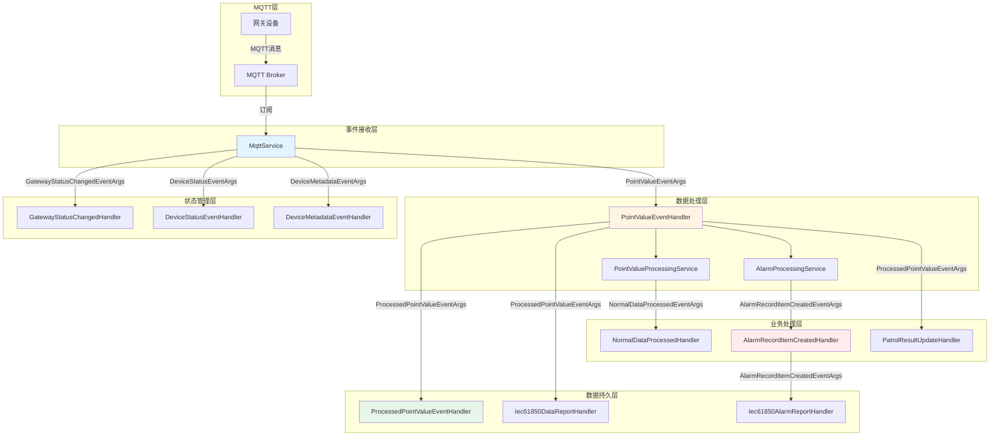

# 事件驱动链路文档

## 概述

本系统采用事件驱动架构（Event-Driven Architecture），基于 ABP Framework 的事件总线机制实现。当网关通过 MQTT 上报数据时，系统通过一系列事件处理器协调完成数据验证、告警检测、状态更新、数据上报等业务流程。

### 核心设计理念

- **解耦性**：各处理器通过事件总线松耦合，独立演进
- **容错性**：关键流程（数据入库）独立于非关键流程（告警处理）
- **可扩展性**：新增业务逻辑只需订阅相应事件
- **顺序保证**：同一处理器内的串行执行，不同处理器间的并行处理

---

## 事件总线机制

### ABP 事件总线

系统使用 ABP Framework 的 `ILocalEventBus` 实进程内事件通信：

```csharp
// 发布事件
await _localEventBus.PublishAsync(new PointValueEventArgs(data));

// 订阅事件（处理器自动注册）
public class MyHandler : ILocalEventHandler<PointValueEventArgs>, ITransientDependency
{
    public async Task HandleEventAsync(PointValueEventArgs eventData)
    {
        // 处理逻辑
    }
}
```

### 事件参数（EventArgs）

所有事件参数继承自统一的基类结构：

| 事件参数 | 用途 | 路径 |
|---------|------|------|
| `PointValueEventArgs` | 点位值变化事件 | `Ast.IntelliSub.Domain.Shared.Etos` |
| `DeviceStatusEventArgs` | 设备状态批量更新事件 | `Ast.IntelliSub.Domain.Shared.Etos` |
| `DeviceMetadataEventArgs` | 设备元数据同步事件 | `Ast.IntelliSub.Domain.Shared.Etos` |
| `GatewayStatusChangedEventArgs` | 网关状态变化事件 | `Ast.IntelliSub.Domain.Shared.Etos` |
| `ProcessedPointValueEventArgs` | 点位值处理完成事件 | `Ast.IntelliSub.Domain.Shared.Etos` |
| `AlarmRecordItemCreatedEventArgs` | 告警记录创建事件 | `Ast.IntelliSub.Application.Contracts.Etos` |
| `NormalDataProcessedEventArgs` | 正常数据处理完成事件 | `Ast.IntelliSub.Application.Contracts.Etos` |

---

## 核心事件处理器

### 1. PointValueEventHandler - 点位值事件处理器

**文件路径**: `module/ast-intellisub/Ast.IntelliSub.Application/EventHandlers/PointValueEventHandler.cs`

**监听事件**: `PointValueEventArgs`

**职责**: 事件接收和协调中心，负责编排整个数据处理流程

**处理流程**:
```
MQTT数据接收 
  ↓
点位值处理服务（验证、转换）
  ↓
告警处理服务（告警检测、合并）
  ↓
正常数据处理（状态恢复触发）
  ↓
数据入库事件发布
```

**关键特性**:
- **批次处理**: 一次性处理多个点位值，提高吞吐量
- **容错隔离**: 告警处理失败不影响数据入库
- **数据过滤**: 根据处理结果过滤丢弃数据
- **告警级别同步**: 将告检测结果同步到点位值对象

**代码示例**:
```csharp
public async Task HandleEventAsync(PointValueEventArgs eventData)
{
    // 1. 数据验证和转换
    var processingContexts = await _pointValueProcessingService.ProcessPointValuesAsync(eventData.Data.PointVals);
    
    // 2. 告警处理（独立于数据入库）
    await _alarmProcessingService.ProcessMergedAlarmsAsync(processingContexts);
    
    // 3. 正常数据处理（状态恢复）
    var normalContexts = processingContexts.Where(c => !c.IsAlarm).ToList();
    await _localEventBus.PublishAsync(new NormalDataProcessedEventArgs(normalContexts));
    
    // 4. 数据入库事件（必须成功）
    var updatedData = UpdateAlarmLevelsFromProcessingContexts(eventData.Data, processingContexts);
    await _localEventBus.PublishAsync(new ProcessedPointValueEventArgs(updatedData));
}
```

---

### 2. ProcessedPointValueEventHandler - 数据入库处理器

**文件路径**: `module/ast-intellisubdata/Ast.IntelliSubData.Application/EventHandlers/ProcessedPointValueEventHandler.cs`

**监听事件**: `ProcessedPointValueEventArgs`

**职责**: 将处理后的点位数据持久化到时序数据库

**处理逻辑**:
1. 遍历所有点位值
2. 构建 `PointDataCreateDto` 对象
3. 调用点位数据服务执行批量插入
4. 记录入库统计信息

**关键特性**:
- **批量写入**: 优化数据库写入性能
- **扩展信息保留**: 保留原始值（RawValue）到扩展字段
- **告警级别保存**: 将告警级别同步到时序数据

**代码示例**:
```csharp
public async Task HandleEventAsync(ProcessedPointValueEventArgs eventData)
{
    foreach (var pointVal in eventData.Data.PointVals)
    {
        var pointData = new PointDataCreateDto
        {
            PointId = pointVal.PointId,
            Value = pointVal.Value,
            AlarmLevel = pointVal.AlarmLevel,
            ExtInfo = pointVal.ExtInfo.ExtendJson(new { raw = pointVal.RawValue })
        };
        await _pointDataService.CreateAsync(pointData);
    }
}
```

---

### 3. AlarmRecordItemCreatedHandler - 告警记录处理器

**文件路径**: `module/ast-intellisub/Ast.IntelliSub.Application/EventHandlers/AlarmRecordItemCreatedHandler.cs`

**监听事件**: `AlarmRecordItemCreatedEventArgs`

**职责**: 处理告警记录创建后的业务逻辑

**处理流程**:
```
告警记录创建
  ↓
查询点位绑定关系
  ↓
更新点位绑定状态 → 异常
  ↓
查询监测项关系
  ↓
更新监测项状态 → 异常
  ↓
查询监测对象聚合根
  ↓
更新监测对象状态 → 异常
  ↓
递归更新父设备状态
```

**关键特性**:
- **级联状态更新**: 点位 → 监测项 → 监测对象 → 父设备
- **状态一致性**: 确保状态变更的原子性
- **幂等性**: 支持重复处理而不产生副作用

---

### 4. GatewayStatusChangedHandler - 网关状态变更处理器

**文件路径**: `module/ast-intellisub/Ast.IntelliSub.Application/EventHandlers/GatewayStatusChangedHandler.cs`

**监听事件**: `GatewayStatusChangedEventArgs`

**职责**: 处理网关上线/下线事件

**处理逻辑**:
1. 查询网关实体
2. 检查状态是否真正变化（避免无效更新）
3. 更新网关状态和最后心跳时间
4. 记录状态变更日志

**事件触发场景**:
- MQTT 连接建立（上线）
- MQTT 连接断开（下线）
- 心跳超时（下线）
- 手动状态切换

**代码示例**:
```csharp
public async Task HandleEventAsync(GatewayStatusChangedEventArgs eventData)
{
    var gateway = await _gatewayRepository.GetByIdAsync(eventData.GatewayId);
    
    if (gateway.Status == eventData.Status)
    {
        gateway.LastHeartbeatTime = DateTime.Now;
        await _gatewayRepository.UpdateAsync(gateway);
        return;
    }
    
    gateway.Status = eventData.Status;
    gateway.LastHeartbeatTime = eventData.ChangeTime;
    await _gatewayRepository.UpdateAsync(gateway);
}
```

---

### 5. DeviceStatusEventHandler - 设备状态处理器

**文件路径**: `module/ast-intellisub/Ast.IntelliSub.Application/EventHandlers/DeviceStatusEventHandler.cs`

**监听事件**: `DeviceStatusEventArgs`

**职责**: 批量处理设备状态更新

**关键特性**:
- **批量优化**: 批量查询和更新，减少数据库往返
- **顺序执行**: 顺序执行更新，保持在同一个 UOW 上下文中
- **统计信息**: 记录处理统计（成功/失败/跳过）

**处理流程**:
```
接收批量设备状态
  ↓
批量查询现有设备
  ↓
构建设备ID映射
  ↓
顺序处理每个设备状态
  ↓
批量更新数据库
```

---

### 6. DeviceMetadataEventHandler - 设备元数据处理器

**文件路径**: `module/ast-intellisub/Ast.IntelliSub.Application/EventHandlers/DeviceMetadataEventHandler.cs`

**监听事件**: `DeviceMetadataEventArgs`

**职责**: 同步网关的设备、传感器、点位元数据

**处理策略**:
- **增量同步**: 仅处理变化的实体
- **级联删除**: 设备删除 → 传感器删除 → 点位删除
- **统计报告**: 记录新增/更新/删除/无变化的数量

**同步范围**:
```
设备元数据
  ├── 设备（Device）
  ├── 传感器（Sensor）
  └── 点位（AstPoint）
```

**代码示例**:
```csharp
public async Task HandleEventAsync(DeviceMetadataEventArgs eventData)
{
    foreach (var deviceDto in eventData.Data.Devices)
    {
        // 1. 同步设备
        await _deviceRepository.InsertOrUpdateAsync(device);
        
        // 2. 同步传感器
        foreach (var sensorDto in deviceDto.Sensors)
        {
            await _sensorRepository.InsertOrUpdateAsync(sensor);
            
            // 3. 同步点位
            foreach (var pointDto in sensorDto.Points)
            {
                await _pointRepository.InsertOrUpdateAsync(point);
            }
        }
    }
}
```

---

### 7. Iec61850DataReportHandler - IEC61850 数据上报处理器

**文件路径**: `module/ast-intellisub/Ast.IntelliSub.Application/EventHandlers/Iec61850DataReportHandler.cs`

**监听事件**: `ProcessedPointValueEventArgs`

**职责**: 将点位数据映射并上报到 IEC61850 协议栈

**处理流程**:
```
点位处理完成事件
  ↓
遍历点位值
  ↓
查找 IEC61850 映射关系（PointKey → Reference）
  ↓
构建上报上下文（IecContext）
  ↓
创建协议处理器
  ↓
执行数据上报
```

**配置开关**:
```json
{
  "Iec61850": {
    "EnableDataReport": true
  }
}
```

**映射规则**:
```
PointKey 格式: {device_id}|{sensor_key}|{property}
```

---

### 8. Iec61850AlarmReportHandler - IEC61850 告警上报处理器

**文件路径**: `module/ast-intellisub/Ast.IntelliSub.Application/EventHandlers/Iec61850AlarmReportHandler.cs`

**监听事件**: `AlarmRecordItemCreatedEventArgs`

**职责**: 将告警信息映射并上报到 IEC61850 协议栈

**处理流程**:
```
告警记录创建事件
  ↓
查询 AstPoint 信息
  ↓
构建告警 PointKey
  ↓
查找 IEC61850 映射关系
  ↓
根据数据类型转换告警值
  ↓
执行告警上报
```

**数据类型映射**:
```csharp
object simulatedValue = mapping.DataType switch
{
    Iec61850DataType.Boolean => alarmValue > 0,
    Iec61850DataType.Int => alarmValue,
    Iec61850DataType.Float => (float)alarmValue,
    Iec61850DataType.String => alarmMessage,
    _ => alarmValue
};
```

---

### 9. PatrolResultUpdateHandler - 巡检结果更新处理器

**文件路径**: `module/ast-intellisub/Ast.IntelliSub.Application/EventHandlers/PatrolResultUpdateHandler.cs`

**监听事件**: `ProcessedPointValueEventArgs`

**职责**: 更新巡检记录项的状态和值

**处理逻辑**:
1. 检查扩展信息中是否包含巡检记录 ID（`prid`）
2. 查询对应的巡检记录项
3. 检查是否存在告警记录
4. 更新巡检记录项状态（正常/异常）
5. 更新巡检记录项值（支持多种数据类型）
6. 收敛总体结果（当所有项处理完成时）

**状态收敛**:
```csharp
// 当无 Processing 状态时，基于最终态收敛总体结果
var hasFinalIssue = await _patrolRecordItemRepository._DbQueryable
    .Where(x => x.PatrolRecordId == patrolRecordId &&
           (x.Result == PatrolDetailResultEnum.Abnormal || 
            x.Result == PatrolDetailResultEnum.Unrecognizable))
    .AnyAsync();

record.OverallResult = hasFinalIssue 
    ? PatrolResultEnum.Abnormal 
    : PatrolResultEnum.Normal;
```

---

### 10. NormalDataProcessedHandler - 正常数据处理器

**文件路径**: `module/ast-intellisub/Ast.IntelliSub.Application/EventHandlers/NormalDataProcessedHandler.cs`

**监听事件**: `NormalDataProcessedEventArgs`

**职责**: 处理正常数据，恢复异常状态

**处理逻辑**:
1. 遍历正常数据上下文
2. 查询点位绑定关系
3. 恢复点位绑定状态（异常 → 正常）
4. 查询监测项关系
5. 恢复监测项状态（异常 → 正常）
6. 查询监测对象
7. 更新监测对象状态（基于所有监测项的状态）

**关键特性**:
- **重试机制**: 支持并发冲突重试（最多3次）
- **指数退避**: 100ms → 200ms → 400ms
- **状态恢复**: 将异常状态恢复为正常状态

**重试方法**:

| 方法 | 重试间隔 | 用途 |
|------|---------|------|
| `ProcessSingleContextWithRetryAsync` | 100ms | 单个处理上下文的完整重试 |
| `UpdateMonitoredObjectItemRelStatusAsync` | 50ms | 监测项关联状态更新重试 |
| `UpdateMonitoredObjectStatusWithRetryAsync` | 50ms | 监测对象状态更新重试 |

**代码示例**:
```csharp
private async Task ProcessSingleContextWithRetryAsync(ProcessingContext context)
{
    for (int attempt = 1; attempt <= maxRetries; attempt++)
    {
        try
        {
            await ProcessSingleContextAsync(context);
            return; // 成功，退出重试
        }
        catch (AbpDbConcurrencyException ex)
        {
            if (attempt == maxRetries) throw;
            await Task.Delay(baseDelayMs * attempt);
        }
    }
}
```

---

## 事件流向图



---

## 处理器依赖关系

### 同一事件的处理器执行顺序

对于 `ProcessedPointValueEventArgs` 事件，多个处理器同时订阅：

| 处理器 | 优先级 | 是否阻塞 | 说明 |
|-------|-------|---------|------|
| ProcessedPointValueEventHandler | 高 | 否 | 数据入库（必须成功） |
| PatrolResultUpdateHandler | 中 | 否 | 巡检结果更新 |
| Iec61850DataReportHandler | 低 | 否 | IEC61850 上报 |

**注意**: ABP 事件总线不保证同一事件的多个处理器执行顺序，关键业务逻辑不应依赖执行顺序。

### 级联事件流

```
PointValueEventArgs (原始数据)
  ↓
PointValueEventHandler (协调器)
  ↓
  ├─→ NormalDataProcessedEventArgs (正常数据)
  │     ↓
  │   NormalDataProcessedHandler (状态恢复)
  │     ↓
  │   AlarmRecordItemCreatedEventArgs (如果产生告警)
  │
  ├─→ AlarmRecordItemCreatedEventArgs (告警数据)
  │     ↓
  │   AlarmRecordItemCreatedHandler (状态更新)
  │     ↓
  │   Iec61850AlarmReportHandler (告警上报)
  │
  └─→ ProcessedPointValueEventArgs (处理完成)
        ↓
        ├─→ ProcessedPointValueEventHandler (数据入库)
        ├─→ PatrolResultUpdateHandler (巡检更新)
        └─→ Iec61850DataReportHandler (数据上报)
```

---

## 异常处理和重试机制

### 异常处理策略

| 处理器 | 异常策略 | 说明 |
|-------|---------|------|
| PointValueEventHandler | 部分容错 | 告警失败不影响入库，入库失败抛出异常 |
| ProcessedPointValueEventHandler | 记录继续 | 单个点位失败不影响批次 |
| AlarmRecordItemCreatedHandler | 记录继续 | 单个告警失败不影响其他 |
| NormalDataProcessedHandler | 重试机制 | 并发冲突自动重试3次 |
| Iec61850DataReportHandler | 记录继续 | 上报失败记录日志 |
| GatewayStatusChangedHandler | 抛出异常 | 状态更新失败抛出异常 |

### 重试机制

**NormalDataProcessedHandler** 实现了指数退避重试：

```csharp
const int maxRetries = 3;
const int baseDelayMs = 100;

for (int attempt = 1; attempt <= maxRetries; attempt++)
{
    try
    {
        await ProcessSingleContextAsync(context);
        return; // 成功，退出
    }
    catch (AbpDbConcurrencyException ex)
    {
        if (attempt == maxRetries) throw;
        await Task.Delay(baseDelayMs * attempt); // 100ms, 200ms, 400ms
    }
}
```

---

## 性能考虑

### 批量处理

- **批次大小**: 默认处理整个 MQTT 消息中的所有点位
- **数据库优化**: 使用批量插入/更新减少往返
- **并发限制**: 同一网关的串行处理，不同网关的并行处理

### 内存管理

- **流式处理**: 避免一次性加载大量数据到内存
- **对象复用**: 重用 DTO 对象减少 GC 压力
- **及时释放**: 使用 `await` 确保异步操作不阻塞线程

### 监控指标

建议监控以下指标：

| 指标 | 说明 | 告警阈值 |
|-----|------|---------|
| 事件处理延迟 | 从接收到完成的时间 | > 5s |
| 事件处理失败率 | 处理失败的事件比例 | > 1% |
| 数据入库延迟 | 数据持久化时间 | > 1s |
| 告警处理延迟 | 告警检测时间 | > 2s |

---

## 配置选项

### IEC61850 上报配置

```json
{
  "Iec61850": {
    "EnableDataReport": true,
    "EnableAlarmReport": true,
    "ModelFiles": [
      "config/iec61850/GISSF60_104.icd"
    ]
  }
}
```

### 事件处理配置

```json
{
  "EventBus": {
    "Handlers": {
      "PointValueEventHandler": {
        "Enabled": true,
        "MaxBatchSize": 1000
      },
      "ProcessedPointValueEventHandler": {
        "Enabled": true,
        "RetryCount": 3
      }
    }
  }
}
```

---

## 最佳实践

### 1. 事件处理器设计原则

- **单一职责**: 每个处理器只负责一个业务领域
- **无状态设计**: 避免在处理器中维护状态
- **幂等性**: 支持重复处理而不产生副作用
- **快速执行**: 处理器应快速完成，避免阻塞

### 2. 错误处理

- **日志记录**: 所有异常都应记录详细日志
- **异常分类**: 区分业务异常和系统异常
- **优雅降级**: 非关键功能失败不应影响核心流程

### 3. 测试建议

- **单元测试**: 测试单个处理器的业务逻辑
- **集成测试**: 测试事件流和处理器协作
- **压力测试**: 测试高并发场景下的性能

---

## 故障排查

### 常见问题

**问题 1: 数据未入库**

- 检查 `PointValueEventHandler` 是否正常执行
- 检查 `ProcessedPointValueEventArgs` 是否发布
- 检查 `ProcessedPointValueEventHandler` 是否订阅成功

**问题 2: 告警未触发**

- 检查点位绑定关系是否存在
- 检查告警策略是否配置正确
- 检查告警阈值是否满足触发条件

**问题 3: 状态未更新**

- 检查监测对象关系是否正确
- 检查状态更新事件是否正常发布
- 检查处理器是否存在并发冲突

### 调试技巧

1. **启用详细日志**:
```json
{
  "Logging": {
    "LogLevel": {
      "Ast.IntelliSub.Application.EventHandlers": "Debug"
    }
  }
}
```

2. **使用 Hangfire 监控**:
访问 `/hangfire` 查看后台任务执行情况

3. **检查事件订阅**:
```csharp
// 在启动时验证处理器是否注册
var handlers = _serviceProvider.GetServices<ILocalEventHandler<PointValueEventArgs>>();
```

---

## 相关文档

- [[Modules/ast-intellisubdata/数据上报流程]] — 点位数据上报流程
- [[Modules/ast-intellisub/设备告警流程]] — 告警处理流程
- [[Modules/isapi/IEC61850数据上报服务]] — IEC61850 集成
- [[Modules/ast-intellisub/Gateway/MqttService]] — MQTT 通信服务

---

**最后更新**: 2026-06-12
**版本**: v1.0.0
