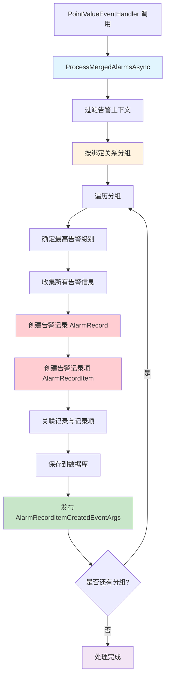
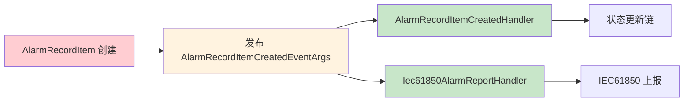

# AlarmProcessingService — 告警合并与编排服务

## 概述

**AlarmProcessingService** 是告警处理的核心服务，负责合并重复告警、创建告警记录项，并触发下游的状态更新和IEC61850上报流程。虽然从命名上看是服务而非EventHandler，但它是事件驱动链路中的关键处理节点。

### 触发来源
- **调用者**: `PointValueEventHandler` 
- **触发场景**: 策略分析检测到告警后
- **处理方式**: 同步调用，非事件订阅

### 核心职责
1. **告警合并** — 合并相同绑定关系的告警，避免重复创建
2. **告警记录创建** — 创建 `AlarmRecordItemEntity` 和 `AlarmRecordEntity`
3. **事件发布** — 发布 `AlarmRecordItemCreatedEventArgs` 触发下游处理
4. **告警级别管理** — 根据策略配置确定告警级别

### 处理特点
- **智能合并**: 相同绑定关系的多个告警合并为一个记录
- **级别优先级**: 保留最高告警级别
- **批量处理**: 一次性处理多个告警上下文
- **关联记录**: 创建告警记录和记录项的关联关系

## 处理流程



## 数据结构

### ProcessingContext（输入）
```csharp
public class ProcessingContext
{
    public PointBindingRelEntity PointBindingRel { get; set; }  // 点位绑定关系
    public MqPointValueItemDto PointVal { get; set; }          // 点位值
    public bool IsAlarm { get; set; }                          // 是否告警
    public bool IsDiscarded { get; set; }                      // 是否丢弃
    public AlarmInfoDto AlarmInfo { get; set; }               // 告警信息
}

public class AlarmInfoDto
{
    public List<AlarmInfoItem> AlarmInfoItems { get; set; }    // 告警信息项列表
}

public class AlarmInfoItem
{
    public string AlarmCategoryName { get; set; }             // 告警分类名称
    public string AlarmContent { get; set; }                   // 告警内容
    public AlarmLevelEnum Level { get; set; }                  // 告警级别
}
```

### AlarmRecordEntity（输出）
```csharp
public class AlarmRecordEntity
{
    public Guid Id { get; set; }                              // 主键
    public DateTime AlarmTime { get; set; }                   // 告警时间
    public AlarmLevelEnum AlarmLevel { get; set; }           // 告警级别
    public int AlarmCount { get; set; }                       // 告警数量
    public string AlarmSummary { get; set; }                  // 告警摘要
}
```

### AlarmRecordItemEntity（输出）
```csharp
public class AlarmRecordItemEntity
{
    public Guid Id { get; set; }                              // 主键
    public Guid AlarmRecordId { get; set; }                  // 关联告警记录ID
    public Guid AstPointId { get; set; }                      // 关联点位ID
    public Guid PointBindingRelId { get; set; }               // 点位绑定关系ID
    public DateTime Ts { get; set; }                          // 采样时间
    public AlarmLevelEnum AlarmLevel { get; set; }            // 告警级别
    public string AlarmCategoryName { get; set; }            // 告警分类名称
    public string AlarmContent { get; set; }                  // 告警内容
}
```

## 告警合并逻辑

### 分组键
```csharp
// 按点位绑定关系ID分组
var groupedAlarms = alarmContexts
    .GroupBy(c => c.PointBindingRel.Id)
    .ToDictionary(g => g.Key, g => g.ToList());
```

### 合并策略
1. **相同绑定关系**: 同一 `PointBindingRelId` 的多个告警合并
2. **最高级别优先**: 保留最高告警级别
3. **信息聚合**: 收集所有告警分类和内容
4. **数量统计**: 统计合并的告警数量

### 级别确定
```csharp
var highestAlarmLevel = contexts
    .Where(c => c.IsAlarm && c.AlarmInfo?.AlarmInfoItems != null)
    .SelectMany(c => c.AlarmInfo.AlarmInfoItems)
    .Max(item => (int)item.Level);

var alarmLevel = (AlarmLevelEnum)highestAlarmLevel;
```

## 核心处理流程

### 1. 告警上下文过滤
```csharp
var alarmContexts = processingContexts
    .Where(c => c.IsAlarm && !c.IsDiscarded)
    .ToList();
```

### 2. 按绑定关系分组
```csharp
var groupedAlarms = alarmContexts
    .GroupBy(c => c.PointBindingRel.Id)
    .ToDictionary(g => g.Key, g => g.ToList());
```

### 3. 创建告警记录
```csharp
var alarmRecord = new AlarmRecordEntity
{
    Id = GuidGenerator.Create(),
    AlarmTime = DateTime.Now,
    AlarmLevel = highestAlarmLevel,
    AlarmCount = contexts.Count,
    AlarmSummary = $"合并{contexts.Count}个告警"
};
```

### 4. 创建告警记录项
```csharp
foreach (var context in contexts)
{
    var alarmInfoItems = context.AlarmInfo?.AlarmInfoItems ?? new List<AlarmInfoItem>();
    
    foreach (var alarmInfo in alarmInfoItems)
    {
        var alarmItem = new AlarmRecordItemEntity
        {
            Id = GuidGenerator.Create(),
            AlarmRecordId = alarmRecord.Id,
            AstPointId = context.PointBindingRel.AstPointId,
            PointBindingRelId = context.PointBindingRel.Id,
            Ts = context.PointVal.Ts,
            AlarmLevel = alarmInfo.Level,
            AlarmCategoryName = alarmInfo.AlarmCategoryName,
            AlarmContent = alarmInfo.AlarmContent
        };
        
        await _alarmRecordItemRepository.InsertAsync(alarmItem);
        
        // 发布事件触发下游处理
        await _localEventBus.PublishAsync(new AlarmRecordItemCreatedEventArgs(alarmItem));
    }
}
```

## 下游事件触发

### AlarmRecordItemCreatedEventArgs
每个告警记录项创建后都会发布此事件，触发以下处理器：

1. **AlarmRecordItemCreatedHandler** — 状态更新链处理器
2. **Iec61850AlarmReportHandler** — IEC61850告警上报处理器

### 事件发布流程


## 依赖服务

| 服务接口 | 用途 | 核心方法 |
|---------|------|---------|
| `ISqlSugarRepository<AlarmRecordEntity>` | 告警记录CRUD | `InsertAsync` |
| `ISqlSugarRepository<AlarmRecordItemEntity>` | 告警记录项CRUD | `InsertAsync` |
| `ILocalEventBus` | 事件总线 | `PublishAsync` |

## 配置项

### 告警策略配置
- 存储位置: 数据库 `AlarmStrategyEntity`
- 配置项: 告警级别、告警分类、告警模板

### 告警级别枚举
```csharp
public enum AlarmLevelEnum
{
    Normal = 0,      // 正常
    Minor = 1,       // 轻微告警
    Important = 2,   // 重要告警
    Urgent = 3       // 紧急告警
}
```

## 错误处理

### 告警处理失败
```csharp
try
{
    await _alarmProcessingService.ProcessMergedAlarmsAsync(processingContexts);
}
catch (Exception ex)
{
    _logger.LogError(ex, "告警处理失败，但不影响数据入库");
    // 告警处理失败不影响数据入库流程
}
```

### 单个记录项失败
```csharp
// 每个记录项独立处理，单个失败不影响其他记录项
try
{
    await _alarmRecordItemRepository.InsertAsync(alarmItem);
    await _localEventBus.PublishAsync(new AlarmRecordItemCreatedEventArgs(alarmItem));
}
catch (Exception ex)
{
    _logger.LogError(ex, $"创建告警记录项失败: {alarmItem.Id}");
}
```

## 日志示例

### 合并处理
```
[告警处理] 5 个告警需要合并处理
[告警合并] 绑定关系ID=xxx, 合并3个告警, 最高级别=Important
[告警记录] 创建告警记录: ID=yyy, 告警数量=3, 告警级别=Important
[告警记录项] 创建记录项: ID=zzz, 告警分类=温度异常, 告警级别=Important
[事件发布] 发布 AlarmRecordItemCreatedEventArgs: 记录项ID=zzz
```

## 相关文档

- [AlarmRecordItemCreatedHandler.md](./AlarmRecordItemCreatedHandler.md) — 状态更新处理器
- [Iec61850AlarmReportHandler.md](./Iec61850AlarmReportHandler.md) — IEC61850告警上报
- [EventDrivenPipeline.md](../EventDrivenPipeline.md) — 事件驱动链路总览

## 源码位置

```
module/ast-intellisub/Ast.IntelliSub.Application/Services/AlarmProcessingService.cs
```
