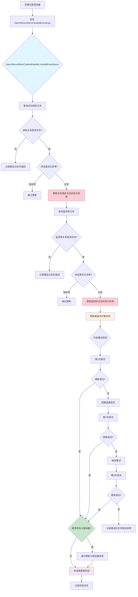
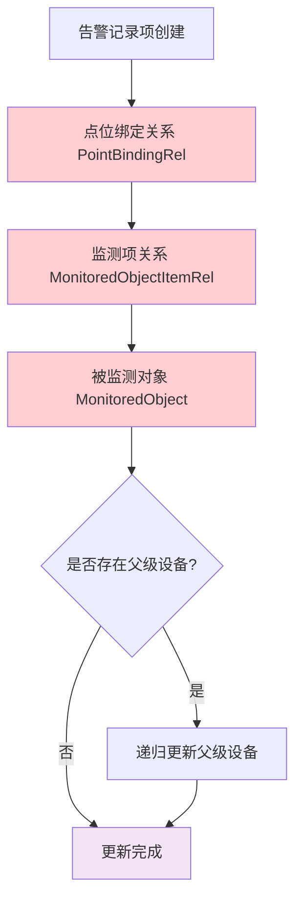

# AlarmRecordItemCreatedHandler — 告警状态更新链处理器

## 概述

**AlarmRecordItemCreatedHandler** 负责告警状态更新链路的级联更新。当告警记录项创建后，它负责将状态从底层到顶层逐级更新为异常状态：**点位绑定关系 → 监测项关系 → 被监测对象**。

### 触发事件
- **事件类型**: `AlarmRecordItemCreatedEventArgs` (Local Event)
- **触发场景**: 告警记录项创建后
- **事件源**: `AlarmProcessingService.ProcessMergedAlarmsAsync` 发布

### 核心职责
1. **级联状态更新** — 从底层到顶层逐级更新状态为异常
2. **并发重试机制** — 处理数据库并发冲突，确保更新成功
3. **父级设备递归** — 支持设备层级结构的递归更新
4. **容错处理** — 状态更新失败不影响告警记录

### 处理特点
- **自底向上**: 从点位绑定关系开始，逐级向上更新
- **条件更新**: 只有当前状态不是异常时才更新
- **重试机制**: 使用指数退避处理并发冲突
- **递归处理**: 支持设备父子关系的递归更新

## 事件结构

### AlarmRecordItemCreatedEventArgs

```csharp
public class AlarmRecordItemCreatedEventArgs
{
    public AlarmRecordItemDto AlarmRecordItem { get; set; }
}

public class AlarmRecordItemDto
{
    public Guid Id { get; set; }                      // 告警记录项ID
    public Guid AstPointId { get; set; }              // 关联点位ID
    public Guid PointBindingRelId { get; set; }       // 点位绑定关系ID
    public AlarmLevelEnum AlarmLevel { get; set; }    // 告警级别
    public string AlarmCategoryName { get; set; }    // 告警分类名称
    public string AlarmContent { get; set; }          // 告警内容
    public DateTime AlarmTime { get; set; }           // 告警时间
}
```

## 处理流程



### 关键处理步骤

#### 1. 点位绑定关系更新
```csharp
var pointBinding = await _pointBindingRepository.GetFirstAsync(p => p.Id == alarmItem.PointBindingRelId);

if (pointBinding.Status != CommonStatusEnum.Abnormal)
{
    var originalStatus = pointBinding.Status;
    pointBinding.Status = CommonStatusEnum.Abnormal;
    await _pointBindingRepository.UpdateAsync(pointBinding);
    _logger.LogDebug($"点位绑定关系状态更新: ID={pointBinding.Id}, {originalStatus} → {CommonStatusEnum.Abnormal}");
}
```

**作用**: 标记该点位绑定关系为异常状态

#### 2. 监测项关系更新
```csharp
var itemRel = await _itemRelRepository.GetFirstAsync(i => i.Id == pointBinding.MonitoredObjectItemRelId);

if (itemRel.Status != CommonStatusEnum.Abnormal)
{
    itemRel.Status = CommonStatusEnum.Abnormal;
    await _itemRelRepository.UpdateAsync(itemRel);
}
```

**作用**: 标记该监测项关系为异常状态

#### 3. 被监测对象更新（含重试）
```csharp
await UpdateMonitoredObjectStatusAsync(itemRel.MonitoredObjectId);

private async Task UpdateMonitoredObjectStatusAsync(Guid monitoredObjectId)
{
    const int maxRetries = 3;
    const int baseDelayMs = 50;

    for (int attempt = 1; attempt <= maxRetries; attempt++)
    {
        try
        {
            var monitoredObject = await _monitoredObjectRepository.GetFirstAsync(m => m.Id == monitoredObjectId);
            if (monitoredObject.Status != CommonStatusEnum.Abnormal)
            {
                monitoredObject.Status = CommonStatusEnum.Abnormal;
                await _monitoredObjectRepository.UpdateAsync(monitoredObject);

                // 递归更新父级设备
                if (monitoredObject.ParentId.HasValue)
                {
                    await UpdateMonitoredObjectStatusAsync(monitoredObject.ParentId.Value);
                }
            }
            return;
        }
        catch (Volo.Abp.Data.AbpDbConcurrencyException ex)
        {
            // 指数退避重试
            if (attempt == maxRetries) throw;
            var delay = baseDelayMs * (int)Math.Pow(2, attempt - 1);
            await Task.Delay(delay);
        }
    }
}
```

**重试策略**:
- 最大重试次数: 3次
- 退避策略: 指数退避 (50ms → 100ms → 200ms)
- 异常类型: 仅对 `AbpDbConcurrencyException` 重试

## 状态更新链路



## 并发重试机制

### 重试配置
| 参数 | 值 | 说明 |
|-----|---|------|
| `maxRetries` | 3 | 最大重试次数 |
| `baseDelayMs` | 50 | 基础延迟（毫秒） |
| 退避策略 | 指数退避 | 50ms → 100ms → 200ms |

### 重试条件
- **异常类型**: `Volo.Abp.Data.AbpDbConcurrencyException`
- **触发场景**: 多个事件处理器同时更新同一实体的状态

### 重试逻辑
```csharp
catch (Volo.Abp.Data.AbpDbConcurrencyException ex)
{
    _logger.LogWarning(ex, "被监测对象状态更新并发冲突，第 {Attempt}/{MaxRetries} 次重试", 
        attempt, maxRetries);

    if (attempt == maxRetries)
    {
        _logger.LogError(ex, "被监测对象状态更新重试失败");
        throw;
    }

    var delay = baseDelayMs * (int)Math.Pow(2, attempt - 1);
    await Task.Delay(delay);
}
```

## 依赖服务

| 仓储接口 | 实体类型 | 用途 |
|---------|---------|------|
| `ISqlSugarRepository<PointBindingRelEntity>` | Guid | 点位绑定关系 |
| `ISqlSugarRepository<MonitoredObjectItemRelEntity>` | Guid | 监测项关系 |
| `ISqlSugarRepository<MonitoredObjectAggregateRoot>` | Guid | 被监测对象 |

## 错误处理

### 绑定关系不存在
```csharp
if (pointBinding == null)
{
    _logger.LogWarning($"点位绑定关系不存在: ID={alarmItem.PointBindingRelId}");
    return;
}
```

### 状态更新失败
```csharp
catch (Exception ex)
{
    _logger.LogError(ex, "告警状态更新失败: 告警项ID={AlarmItemId}", 
        eventData.AlarmRecordItem?.Id);
    // 不重新抛出异常，避免影响其他处理流程
}
```

## 日志示例

### 正常流程
```
处理告警记录项状态更新: 告警项ID=xxx, 点位绑定关系ID=yyy
点位绑定关系状态更新: ID=yyy, Normal → Abnormal
监测项关系状态更新: ID=zzz, Normal → Abnormal
被监测对象状态更新: ID=aaa, Normal → Abnormal
检测到父级设备，开始更新父级设备状态: ParentId=bbb
告警状态更新链完成: 告警项ID=xxx, 级别=Important
```

### 并发重试
```
被监测对象状态更新并发冲突，第 1/3 次重试，监测对象ID: xxx
被监测对象状态更新并发冲突，第 2/3 次重试，监测对象ID: xxx
被监测对象状态更新: ID=xxx, Normal → Abnormal
```

### 失败场景
```
点位绑定关系不存在: ID=xxx
监测对象状态更新重试失败，监测对象ID: xxx
告警状态更新失败: 告警项ID=xxx
```

## 订阅关系

### 上游发布者
- `AlarmProcessingService` — 告警处理服务（合并告警并创建记录项）

### 同级订阅者（同一事件）
- `Iec61850AlarmReportHandler` — IEC61850告警上报处理器

## 相关文档

- [NormalDataProcessedHandler.md](./NormalDataProcessedHandler.md) — 状态恢复处理器（反向操作）
- [AlarmProcessingService.md](../../Services/AlarmProcessingService.md) — 告警处理服务
- [EventDrivenPipeline.md](../EventDrivenPipeline.md) — 事件驱动链路总览

## 源码位置

```
module/ast-intellisub/Ast.IntelliSub.Application/EventHandlers/AlarmRecordItemCreatedHandler.cs
```
