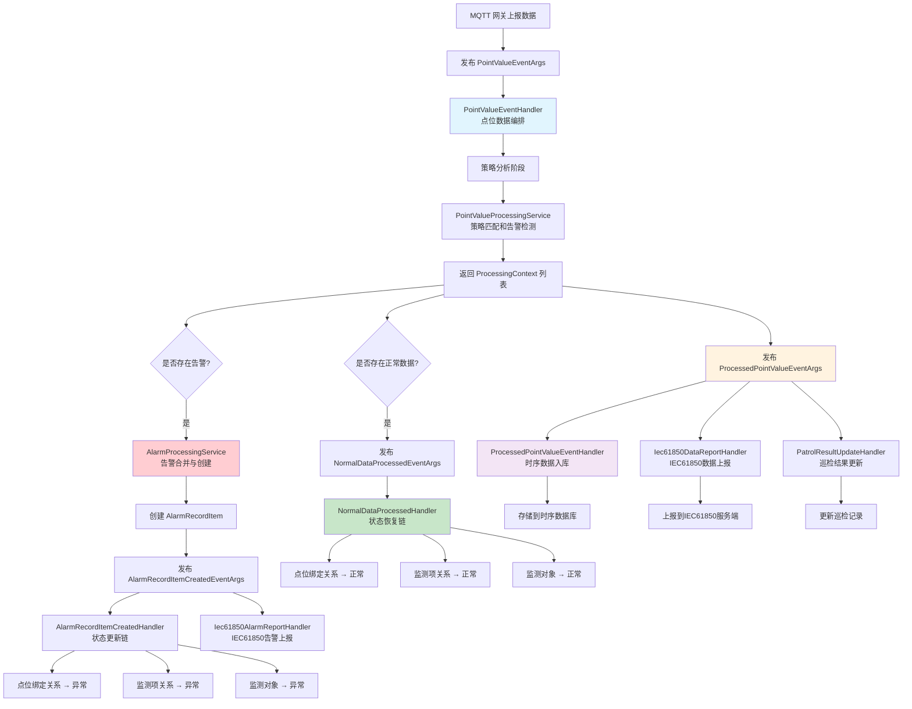
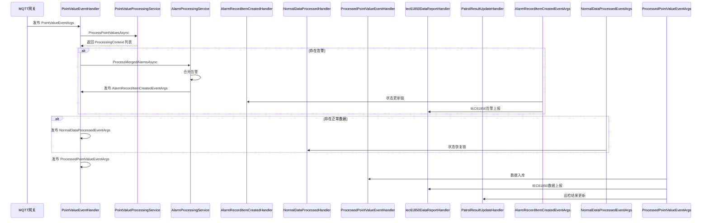

# EventHandler 全链路概览

## 概述

本文档提供系统中所有 EventHandler 的完整视图，展示它们如何协同工作形成完整的事件驱动链路。系统使用 **ABP Local Event Bus** 实现模块间的解耦通信。

## EventHandler 分类

### 按功能域分类

| 域 | EventHandler | 触发事件 | 核心职责 |
|----|-------------|---------|---------|
| **点位数据处理** | `PointValueEventHandler` | `PointValueEventArgs` | 点位数据编排和协调 |
| **点位数据处理** | `ProcessedPointValueEventHandler` | `ProcessedPointValueEventArgs` | 时序数据入库 |
| **告警处理** | `AlarmRecordItemCreatedHandler` | `AlarmRecordItemCreatedEventArgs` | 告警状态更新链 |
| **告警处理** | `AlarmProcessingService` | 直接调用 | 告警合并与创建 |
| **数据上报** | `Iec61850DataReportHandler` | `ProcessedPointValueEventArgs` | IEC61850数据上报 |
| **数据上报** | `Iec61850AlarmReportHandler` | `AlarmRecordItemCreatedEventArgs` | IEC61850告警上报 |
| **巡检处理** | `PatrolResultUpdateHandler` | `ProcessedPointValueEventArgs` | 巡检结果更新 |
| **状态恢复** | `NormalDataProcessedHandler` | `NormalDataProcessedEventArgs` | 状态恢复链 |

## 完整事件驱动链路



## 事件流转详解

### 1. 数据接收阶段

**触发**: MQTT 网关收到设备传感器数据

**事件**: `PointValueEventArgs`

**订阅者**: `PointValueEventHandler`

**处理**:
- 接收原始点位数据
- 委托策略分析
- 协调告警处理
- 触发状态恢复
- 准备数据入库

### 2. 策略分析阶段

**服务**: `IPointValueProcessingService`

**输入**: `List<MqPointValueItemDto>`

**输出**: `List<ProcessingContext>`

**处理**:
- 点位绑定关系查找
- 策略配置匹配
- 告警条件判断
- 数据丢弃决策

### 3. 告警处理阶段

**服务**: `AlarmProcessingService`

**输入**: 告警上下文列表

**输出**: `AlarmRecordItemEntity`

**处理**:
- 告警合并（相同绑定关系）
- 告警级别确定
- 告警记录创建
- 事件发布

**触发事件**: `AlarmRecordItemCreatedEventArgs`

**订阅者**:
- `AlarmRecordItemCreatedHandler` — 状态更新
- `Iec61850AlarmReportHandler` — IEC61850上报

### 4. 状态更新阶段

**Handler**: `AlarmRecordItemCreatedHandler`

**处理链路**: 点位绑定关系 → 监测项关系 → 监测对象

**特点**:
- 自底向上更新
- 条件更新（非异常才更新）
- 并发重试机制
- 递归更新父级设备

### 5. 状态恢复阶段

**事件**: `NormalDataProcessedEventArgs`

**订阅者**: `NormalDataProcessedHandler`

**处理链路**: 监测对象 → 监测项关系 → 点位绑定关系

**特点**:
- 条件恢复（所有子项正常才恢复）
- 自底向上恢复
- 并发重试机制
- 递归恢复父级设备

### 6. 数据入库阶段

**事件**: `ProcessedPointValueEventArgs`

**订阅者**:
- `ProcessedPointValueEventHandler` — 时序数据入库
- `Iec61850DataReportHandler` — IEC61850数据上报
- `PatrolResultUpdateHandler` — 巡检结果更新

**特点**:
- 批量并发处理
- 容错设计（单点失败不影响整体）
- 模块独立（各自属于不同模块）

## 事件定义总览

### PointValueEventArgs
```csharp
public class PointValueEventArgs : MqttMessageEventArgs<MqPointValueDto>
{
    public Guid GatewayId { get; set; }
    public string Type { get; set; }           // "point_value"
    public MqPointValueDto Data { get; set; }
}
```

### ProcessedPointValueEventArgs
```csharp
public class ProcessedPointValueEventArgs
{
    public MqPointValueDto Data { get; set; }   // 已更新告警级别，已过滤丢弃数据
}
```

### NormalDataProcessedEventArgs
```csharp
public class NormalDataProcessedEventArgs
{
    public List<ProcessingContext> NormalContexts { get; set; }
}
```

### AlarmRecordItemCreatedEventArgs
```csharp
public class AlarmRecordItemCreatedEventArgs
{
    public AlarmRecordItemDto AlarmRecordItem { get; set; }
}
```

## 处理时间线



## 模块归属

| EventHandler | 所属模块 | 职责领域 |
|-------------|---------|---------|
| `PointValueEventHandler` | ast-intellisub | 点位数据编排 |
| `AlarmRecordItemCreatedHandler` | ast-intellisub | 告警状态管理 |
| `NormalDataProcessedHandler` | ast-intellisub | 状态恢复管理 |
| `AlarmProcessingService` | ast-intellisub | 告警处理服务 |
| `Iec61850DataReportHandler` | ast-intellisub | IEC61850数据上报 |
| `Iec61850AlarmReportHandler` | ast-intellisub | IEC61850告警上报 |
| `PatrolResultUpdateHandler` | ast-intellisub | 巡检结果管理 |
| `ProcessedPointValueEventHandler` | ast-intellisubdata | 时序数据存储 |

## 设计模式

### 1. 编排者模式 (PointValueEventHandler)
- 负责流程编排，不处理具体业务逻辑
- 协调多个服务和事件
- 确保数据流向正确

### 2. 观察者模式 (Event Bus)
- 事件发布者与订阅者解耦
- 一对多的事件分发
- 支持多个订阅者

### 3. 责任链模式 (状态更新/恢复)
- 自底向上的状态传播
- 递归处理父子关系
- 条件更新/恢复

### 4. 策略模式 (PointValueProcessingService)
- 可配置的策略匹配
- 灵活的告警判断
- 数据丢弃决策

## 性能考虑

### 批量处理
- 所有点位数据批量处理
- 减少数据库访问次数
- 提高整体吞吐量

### 并发处理
- IEC61850上报按ICD文件分组并发
- 避免单个分组阻塞整体
- 提高上报效率

### 容错设计
- 单个点位失败不影响其他点位
- 单个分组失败不影响其他分组
- 告警处理失败不影响数据入库

### 并发重试
- 指数退避重试策略
- 仅对并发冲突重试
- 限制最大重试次数

## 相关文档

### 详细文档
- [PointValueEventHandler.md](./PointValueEventHandler.md) — 点位编排处理器
- [ProcessedPointValueEventHandler.md](./ProcessedPointValueEventHandler.md) — 时序数据入库
- [AlarmRecordItemCreatedHandler.md](./AlarmRecordItemCreatedHandler.md) — 告警状态更新
- [NormalDataProcessedHandler.md](./NormalDataProcessedHandler.md) — 状态恢复
- [Iec61850DataReportHandler.md](./Iec61850DataReportHandler.md) — IEC61850数据上报
- [PatrolEventHandler.md](./PatrolEventHandler.md) — 巡检结果更新

### 架构文档
- [EventDrivenPipeline.md](../EventDrivenPipeline.md) — 事件驱动链路总览
- [ArchitectureOverview.md](../../../Architecture/ArchitectureOverview.md) — 系统架构总览

## 源码位置

```
module/ast-intellisub/Ast.IntelliSub.Application/EventHandlers/
module/ast-intellisubdata/Ast.IntelliSubData.Application/EventHandlers/
```
