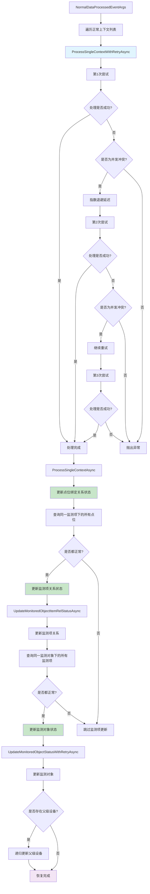
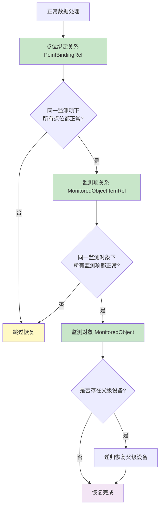

# NormalDataProcessedHandler — 状态恢复处理器

## 概述

**NormalDataProcessedHandler** 负责正常数据的状态恢复链路。当传感器数据正常时，它负责将状态从顶层逐级恢复为正常状态：**被监测对象 → 监测项关系 → 点位绑定关系**。

### 触发事件
- **事件类型**: `NormalDataProcessedEventArgs` (Local Event)
- **触发场景**: 策略分析结果为正常数据
- **事件源**: `PointValueEventHandler` 发布

### 核心职责
1. **级联状态恢复** — 从底层到顶层逐级恢复状态为正常
2. **条件恢复** — 只有当所有相关项都正常时才恢复
3. **并发重试** — 处理数据库并发冲突
4. **父级设备恢复** — 支持设备层级结构的递归恢复

### 处理特点
- **自底向上**: 从点位绑定关系开始，逐级向上恢复
- **条件恢复**: 所有子项都正常时才恢复父项
- **批量处理**: 一次性处理多个正常上下文
- **反向操作**: 与 `AlarmRecordItemCreatedHandler` 相反

## 事件结构

### NormalDataProcessedEventArgs

```csharp
public class NormalDataProcessedEventArgs
{
    public List<ProcessingContext> NormalContexts { get; set; }
}

public class ProcessingContext
{
    public PointBindingRelEntity PointBindingRel { get; set; }  // 点位绑定关系
    public MqPointValueItemDto PointVal { get; set; }          // 点位值
    public bool IsAlarm { get; set; }                          // 是否告警
    public bool IsDiscarded { get; set; }                      // 是否丢弃
    public AlarmInfoDto AlarmInfo { get; set; }               // 告警信息
}
```

## 处理流程



### 关键处理步骤

#### 1. 点位绑定关系状态恢复
```csharp
var point = await _pointBindingRepository.GetFirstAsync(p =>
    p.Id == context.PointBindingRel.Id);

point.Status = CommonStatusEnum.Normal;
await _pointBindingRepository.UpdateAsync(point);
```

#### 2. 监测项关系状态恢复（条件恢复）
```csharp
// 检查同一监测项关系下的所有点位绑定关系状态
var allAstPoint = await _pointBindingRepository.GetListAsync(p =>
    p.MonitoredObjectItemRelId == context.PointBindingRel.MonitoredObjectItemRelId);

// 只有当同一监测项关系下所有点位都正常时，才恢复监测项关系状态
if (!allAstPoint.Exists(p => p.Status == CommonStatusEnum.Abnormal))
{
    await UpdateMonitoredObjectItemRelStatusAsync(itemRelId);
}
```

#### 3. 监测对象状态恢复（条件恢复）
```csharp
// 检查同一监测对象下的所有监测项关系状态
var allItemRel = await _itemRelRepository.GetListAsync(i =>
    i.MonitoredObjectId == itemRel.MonitoredObjectId);

// 只有当同一监测对象下所有监测项都正常时，才恢复监测对象状态
if (!allItemRel.Exists(p => p.Status == CommonStatusEnum.Abnormal))
{
    await UpdateMonitoredObjectStatusWithRetryAsync(itemRel.MonitoredObjectId);
}
```

#### 4. 父级设备递归恢复
```csharp
var monitoredObject = await _monitoredObjectRepository.GetFirstAsync(m =>
    m.Id == monitoredObjectId);

monitoredObject.Status = CommonStatusEnum.Normal;
await _monitoredObjectRepository.UpdateAsync(monitoredObject);

// 检查是否存在父级设备，如果存在则递归更新父级设备状态
if (monitoredObject.ParentId.HasValue)
{
    await UpdateMonitoredObjectStatusWithRetryAsync(monitoredObject.ParentId.Value);
}
```

## 状态恢复链路



## 并发重试机制

### 重试配置
| 参数 | 值 | 说明 |
|-----|---|------|
| `maxRetries` | 3 | 最大重试次数 |
| `baseDelayMs` | 100/50 | 基础延迟（毫秒） |
| 退避策略 | 指数退避 | 100ms → 200ms → 400ms |

### 重试条件
- **异常类型**: `Volo.Abp.Data.AbpDbConcurrencyException`
- **触发场景**: 多个事件处理器同时更新同一实体的状态

### 重试逻辑
```csharp
for (int attempt = 1; attempt <= maxRetries; attempt++)
{
    try
    {
        await ProcessSingleContextAsync(context);
        return; // 成功处理，退出重试循环
    }
    catch (Volo.Abp.Data.AbpDbConcurrencyException ex)
    {
        if (attempt == maxRetries)
        {
            throw; // 达到最大重试次数，重新抛出异常
        }
        
        var delay = baseDelayMs * (int)Math.Pow(2, attempt - 1);
        await Task.Delay(delay);
    }
}
```

## 依赖服务

| 仓储接口 | 实体类型 | 用途 |
|---------|---------|------|
| `ISqlSugarRepository<PointBindingRelEntity>` | Guid | 点位绑定关系 |
| `ISqlSugarRepository<MonitoredObjectItemRelEntity>` | Guid | 监测项关系 |
| `ISqlSugarRepository<MonitoredObjectAggregateRoot>` | Guid | 被监测对象 |

## 条件恢复机制

### 恢复条件
1. **点位绑定关系**: 单个点位数据正常即可恢复
2. **监测项关系**: 该监测项下**所有**点位绑定关系都正常才恢复
3. **监测对象**: 该监测对象下**所有**监测项关系都正常才恢复

### 恢复逻辑
```csharp
// 点位绑定关系恢复
point.Status = CommonStatusEnum.Normal;

// 监测项关系恢复（条件）
if (!allAstPoint.Exists(p => p.Status == CommonStatusEnum.Abnormal))
{
    itemRel.Status = CommonStatusEnum.Normal;
}

// 监测对象恢复（条件）
if (!allItemRel.Exists(p => p.Status == CommonStatusEnum.Abnormal))
{
    monitoredObject.Status = CommonStatusEnum.Normal;
}
```

## 错误处理

### 并发冲突重试
```csharp
catch (Volo.Abp.Data.AbpDbConcurrencyException ex)
{
    _logger.LogWarning(ex, "正常数据处理并发冲突，第 {Attempt}/{MaxRetries} 次重试，点位绑定ID: {PointBindingId}",
        attempt, maxRetries, context.PointBindingRel.Id);

    if (attempt == maxRetries)
    {
        throw; // 达到最大重试次数
    }

    var delay = baseDelayMs * (int)Math.Pow(2, attempt - 1);
    await Task.Delay(delay);
}
```

### 非并发异常
```csharp
catch (Exception ex)
{
    _logger.LogError(ex, "正常数据处理失败，非并发异常，点位绑定ID: {PointBindingId}",
        context.PointBindingRel.Id);
    throw; // 非并发异常直接抛出
}
```

## 日志示例

### 正常流程
```
监测对象状态已更新为正常: xxx
监测项关系状态更新: ID=yyy, Abnormal → Normal
点位绑定关系状态更新: ID=zzz, Abnormal → Normal
```

### 并发重试
```
正常数据处理并发冲突，第 1/3 次重试，点位绑定ID: xxx
正常数据处理并发冲突，第 2/3 次重试，点位绑定ID: xxx
监测对象状态已更新为正常: xxx
```

### 递归恢复
```
检测到父级设备，开始更新父级设备状态: ParentId=xxx
监测对象状态已更新为正常: xxx
```

## 订阅关系

### 上游发布者
- `PointValueEventHandler` — 点位编排处理器

### 下游处理
- 状态恢复完成后无下游事件，直接更新数据库

## 相关文档

- [AlarmRecordItemCreatedHandler.md](./AlarmRecordItemCreatedHandler.md) — 告警状态更新处理器（反向操作）
- [EventDrivenPipeline.md](../EventDrivenPipeline.md) — 事件驱动链路总览

## 源码位置

```
module/ast-intellisub/Ast.IntelliSub.Application/EventHandlers/NormalDataProcessedHandler.cs
```
