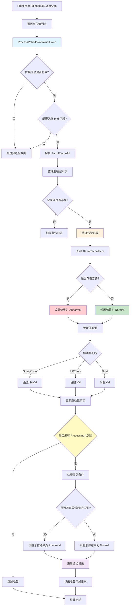

# PatrolResultUpdateHandler — 巡检结果更新处理器

## 概述

**PatrolResultUpdateHandler** 负责巡检任务的数据采集和结果收敛。它监听处理后的点位数据，识别巡检数据并更新巡检记录项的状态和值，最终收敛巡检记录的总体结果。

### 触发事件
- **事件类型**: `ProcessedPointValueEventArgs` (Local Event)
- **触发场景**: 传感器数据处理完成，包含巡检数据
- **事件源**: `PointValueEventHandler` 发布

### 核心职责
1. **巡检数据识别** — 通过扩展信息识别巡检相关数据
2. **记录项更新** — 更新巡检记录项的状态、值和类型
3. **告警关联** — 检查是否存在关联告警记录
4. **结果收敛** — 当所有巡检项完成时收敛总体结果

### 处理特点
- **扩展信息识别**: 通过 `ExtInfo.prid` 字段识别巡检数据
- **状态联动**: 根据是否存在告警记录确定巡检结果
- **值类型适配**: 支持String、Int、Float、Json等多种值类型
- **收敛机制**: 仅在所有巡检项完成后才收敛总体结果

## 事件结构

### ProcessedPointValueEventArgs（输入）

```csharp
public class ProcessedPointValueEventArgs
{
    public MqPointValueDto Data { get; set; }
}

public class MqPointValueItemDto
{
    public DateTime Ts { get; set; }                   // 采样时间戳
    public string PointId { get; set; }               // 点位ID
    public object Value { get; set; }                 // 值
    public object RawValue { get; set; }              // 原始值
    public DataValueTypeEnum? ValueType { get; set; } // 值类型
    public string ExtInfo { get; set; }               // 扩展信息(JSON)
}

// 扩展信息格式
{
  "prid": "guid-string"  // PatrolRecordId 巡检记录ID
}
```

### PatrolRecordItemEntity（更新目标）

```csharp
public class PatrolRecordItemEntity
{
    public Guid Id { get; set; }                              // 主键
    public Guid PatrolRecordId { get; set; }                // 巡检记录ID
    public Guid PointId { get; set; }                        // 点位ID
    public DateTime Ts { get; set; }                         // 采样时间
    public PatrolDetailResultEnum Result { get; set; }      // 巡检结果
    public DataValueTypeEnum ValueType { get; set; }        // 值类型
    public double? Val { get; set; }                        // 数值
    public string StrVal { get; set; }                       // 字符串值
}
```

### PatrolRecordEntity（收敛目标）

```csharp
public class PatrolRecordEntity
{
    public Guid Id { get; set; }                              // 主键
    public PatrolResultEnum OverallResult { get; set; }     // 总体结果
}
```

## 处理流程



### 关键处理步骤

#### 1. 巡检数据识别
```csharp
// 解析扩展信息
Dictionary<string, object> extInfo = JsonSerializer.Deserialize<Dictionary<string, object>>(pointValue.ExtInfo);

if (!extInfo.ContainsKey("prid"))
{
    return; // 不是巡检数据
}

var patrolRecordId = Guid.Parse(extInfo["prid"].ToString());
```

#### 2. 巡检记录项查询
```csharp
var recordItem = await _patrolRecordItemRepository._DbQueryable
    .FirstAsync(x => 
        x.PatrolRecordId == patrolRecordId && 
        x.PointId == pointId && 
        x.Ts == pointValue.Ts);
```

#### 3. 告警关联检查
```csharp
var hasAlarm = await _alarmRecordItemRepository._DbQueryable
    .AnyAsync(x => 
        x.AstPointId == pointId && 
        x.Ts == pointValue.Ts);

recordItem.Result = hasAlarm
    ? PatrolDetailResultEnum.Abnormal
    : PatrolDetailResultEnum.Normal;
```

#### 4. 值类型适配
```csharp
recordItem.ValueType = (DataValueTypeEnum)pointValue.ValueType;

if (recordItem.ValueType == DataValueTypeEnum.String || 
    recordItem.ValueType == DataValueTypeEnum.Json)
{
    recordItem.StrVal = pointValue.Value?.ToString();
    recordItem.Val = null;
}
else if(recordItem.ValueType == DataValueTypeEnum.Int || 
        recordItem.ValueType == DataValueTypeEnum.Enum)
{
    recordItem.StrVal = null;
    recordItem.Val = Convert.ToInt32(pointValue.Value);
}
else
{
    recordItem.StrVal = null;
    recordItem.Val = Convert.ToDouble(pointValue.Value);
}
```

#### 5. 结果收敛
```csharp
// 检查是否还有 Processing 状态的记录项
var hasProcessing = await _patrolRecordItemRepository._DbQueryable
    .Where(x => x.PatrolRecordId == patrolRecordId && x.Result == PatrolDetailResultEnum.Processing)
    .AnyAsync();

if (!hasProcessing)
{
    // 检查是否存在异常或无法识别的记录项
    var hasFinalIssue = await _patrolRecordItemRepository._DbQueryable
        .Where(x => x.PatrolRecordId == patrolRecordId &&
               (x.Result == PatrolDetailResultEnum.Abnormal || 
                x.Result == PatrolDetailResultEnum.Unrecognizable))
        .AnyAsync();

    record.OverallResult = hasFinalIssue ? PatrolResultEnum.Abnormal : PatrolResultEnum.Normal;
    await _patrolRecordRepository.UpdateAsync(record);
}
```

## 巡检结果状态

### PatrolDetailResultEnum（记录项级别）

```csharp
public enum PatrolDetailResultEnum
{
    Processing,       // 处理中
    Normal,          // 正常
    Abnormal,        // 异常
    Unrecognizable   // 无法识别
}
```

### PatrolResultEnum（记录级别）

```csharp
public enum PatrolResultEnum
{
    Processing,       // 处理中
    Normal,          // 正常
    Abnormal         // 异常
}
```

## 收敛机制

### 收敛条件
1. **完成度检查**: 所有巡检记录项都不再是 `Processing` 状态
2. **结果计算**: 
   - 存在 `Abnormal` 或 `Unrecognizable` → 总体结果为 `Abnormal`
   - 全部为 `Normal` → 总体结果为 `Normal`

### 收敛时机
- 每次更新巡检记录项后检查
- 仅在所有记录项完成时才收敛

### 防止重复收敛
- 通过检查是否存在 `Processing` 状态来避免重复收敛
- 使用数据库查询确保状态的实时性

## 依赖服务

| 仓储接口 | 实体类型 | 用途 |
|---------|---------|------|
| `ISqlSugarRepository<PatrolRecordItemEntity>` | Guid | 巡检记录项 |
| `ISqlSugarRepository<AlarmRecordItemEntity>` | Guid | 告警记录项 |
| `ISqlSugarRepository<PatrolRecordEntity>` | Guid | 巡检记录 |

## 错误处理

### 扩展信息解析失败
```csharp
try
{
    extInfo = JsonSerializer.Deserialize<Dictionary<string, object>>(pointValue.ExtInfo);
}
catch
{
    return; // 解析失败，忽略
}
```

### 记录项不存在
```csharp
if (recordItem == null)
{
    _logger.LogWarning("未找到对应的巡检记录项: PatrolRecordId={PatrolRecordId}, PointId={PointId}, Ts={Ts}", 
        patrolRecordId, pointValue.PointId, pointValue.Ts);
    return;
}
```

### 单个点位处理失败
```csharp
catch (Exception ex)
{
    _logger.LogError(ex, "处理单个巡检点位值失败: PointId={PointId}, Ts={Ts}", 
        pointValue.PointId, pointValue.Ts);
    // 继续处理下一个点位
}
```

## 日志示例

### 正常流程
```
更新巡视记录项状态和值: PatrolRecordId=xxx, PointId=yyy, Result=Processing->Normal, ValueType=Float, Value=23.5, HasAlarm=false
收敛总体结果: RecordId=xxx, OverallResult=Normal
[巡视状态更新] 5 个点位已更新状态和值
```

### 告警关联
```
更新巡视记录项状态和值: PatrolRecordId=xxx, PointId=yyy, Result=Processing->Abnormal, ValueType=Float, Value=85.2, HasAlarm=true
收敛总体结果: RecordId=xxx, OverallResult=Abnormal
```

### 异常场景
```
未找到对应的巡检记录项: PatrolRecordId=xxx, PointId=yyy, Ts=2024-01-01 10:00:00
处理单个巡检点位值失败: PointId=yyy, Ts=2024-01-01 10:00:00
```

## 订阅关系

### 上游发布者
- `PointValueEventHandler` — 点位编排处理器

### 同级订阅者（同一事件）
- `ProcessedPointValueEventHandler` — 时序数据入库处理器
- `Iec61850DataReportHandler` — IEC61850数据上报处理器

## 性能特点

1. **条件识别**: 仅处理包含 `prid` 的巡检数据
2. **批量更新**: 一次性更新巡检记录项的多个字段
3. **延迟收敛**: 仅在所有巡检项完成后才收敛
4. **容错设计**: 单个巡检项失败不影响其他巡检项

## 相关文档

- [PatrolService.md](../../../Services/PatrolService.md) — 巡检服务
- [EventDrivenPipeline.md](../EventDrivenPipeline.md) — 事件驱动链路总览

## 源码位置

```
module/ast-intellisub/Ast.IntelliSub.Application/EventHandlers/PatrolResultUpdateHandler.cs
```
