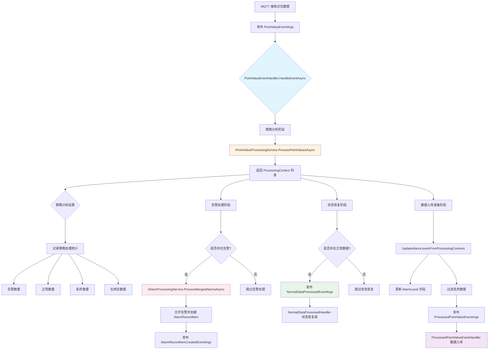

# PointValueEventHandler — 点位值编排处理器

## 概述

**PointValueEventHandler** 是事件驱动链路的核心编排器，负责协调点位数据的处理流程。它接收来自 MQTT 的原始点位数据，协调策略分析、告警处理、状态恢复和数据入库等处理流程。

### 触发事件
- **事件类型**: `PointValueEventArgs` (Local Event)
- **触发场景**: MQTT 网关上报设备传感器点位数据
- **事件源**: 边缘设备通过 MQTT 协议上报

### 核心职责
1. **策略分析编排** — 委托 `IPointValueProcessingService` 进行策略匹配和告警检测
2. **告警处理协调** — 协调 `IAlarmProcessingService` 进行告警合并和创建
3. **状态恢复触发** — 发布 `NormalDataProcessedEventArgs` 触发状态恢复链
4. **数据入库协调** — 发布 `ProcessedPointValueEventArgs` 触发时序数据入库

### 处理特点
- **编排者模式**: 本身不处理业务逻辑，仅负责事件协调和流程编排
- **容错机制**: 告警处理失败不影响数据入库，确保数据不丢失
- **数据过滤**: 自动过滤被策略标记为丢弃的数据
- **告警级别传递**: 将策略分析结果中的告警级别传递给下游入库流程

## 事件结构

### PointValueEventArgs

```csharp
public class PointValueEventArgs
{
    public Guid GatewayId { get; set; }              // 网关ID
    public string Type { get; set; }                  // 消息类型 "point_value"
    public MqPointValueDto Data { get; set; }         // 点位值数据
}

public class MqPointValueDto
{
    public List<MqPointValueItemDto> PointVals { get; set; }  // 点位值列表
}

public class MqPointValueItemDto
{
    public DateTime Ts { get; set; }                   // 采样时间戳
    public string DeviceId { get; set; }              // 设备ID
    public string SensorKey { get; set; }             // 传感器标识
    public string Property { get; set; }              // 属性名
    public string GroupId { get; set; }               // 分组ID
    public object Value { get; set; }                 // 处理后的值
    public object RawValue { get; set; }              // 原始值
    public DataValueTypeEnum? ValueType { get; set; }  // 值类型
    public string ExtInfo { get; set; }               // 扩展信息(JSON)
    public string PointId { get; set; }               // 点位ID
    public AlarmLevelEnum AlarmLevel { get; set; }    // 告警级别
}
```

## 处理流程



### 关键处理步骤

#### 1. 策略分析阶段
```csharp
// 委托点位值处理服务进行策略匹配和告警检测
processingContexts = await _pointValueProcessingService.ProcessPointValuesAsync(eventData.Data.PointVals);
```

**输出**: `List<ProcessingContext>` 包含每个点位的处理结果：
- `IsAlarm`: 是否触发告警
- `IsDiscarded`: 是否被策略丢弃
- `AlarmInfo`: 告警信息（包含告警级别和内容）
- `PointBindingRel`: 点位绑定关系

#### 2. 告警处理阶段
```csharp
var alarmContexts = processingContexts.Where(c => c.IsAlarm && !c.IsDiscarded).ToList();
if (alarmContexts.Any())
{
    await _alarmProcessingService.ProcessMergedAlarmsAsync(processingContexts);
}
```

**特点**:
- 独立 try-catch，失败不影响数据入库
- 合并相同绑定关系的告警，避免重复创建
- 触发下游 `AlarmRecordItemCreatedHandler` 和 `Iec61850AlarmReportHandler`

#### 3. 状态恢复阶段
```csharp
var normalContexts = processingContexts.Where(c => !c.IsAlarm && !c.IsDiscarded).ToList();
if (normalContexts.Any())
{
    await _localEventBus.PublishAsync(new NormalDataProcessedEventArgs(normalContexts));
}
```

**作用**: 触发状态恢复链路，将异常状态恢复为正常

#### 4. 数据入库准备阶段
```csharp
// 更新告警级别并过滤丢弃数据
var updatedData = UpdateAlarmLevelsFromProcessingContexts(eventData.Data, processingContexts);
await _localEventBus.PublishAsync(new ProcessedPointValueEventArgs(updatedData));
```

**关键操作**:
- 将 `ProcessingContext` 中的告警级别同步到 `MqPointValueItemDto.AlarmLevel`
- 过滤掉 `IsDiscarded = true` 的数据，避免入库
- 必须成功，否则抛出异常

## 依赖服务

| 服务接口 | 用途 | 核心方法 |
|---------|------|---------|
| `IPointValueProcessingService` | 策略分析和告警检测 | `ProcessPointValuesAsync` |
| `IAlarmProcessingService` | 告警合并和创建 | `ProcessMergedAlarmsAsync` |
| `ILocalEventBus` | 事件总线 | `PublishAsync` |

## 下游事件发布

| 事件类型 | 触发条件 | 订阅者 |
|---------|---------|--------|
| `NormalDataProcessedEventArgs` | 存在正常数据 | `NormalDataProcessedHandler` |
| `ProcessedPointValueEventArgs` | 数据入库准备完成 | `ProcessedPointValueEventHandler`, `Iec61850DataReportHandler`, `PatrolResultUpdateHandler` |

## 配置项

本 Handler 无直接配置，依赖以下服务配置：

### 策略配置
- 位置: 数据库 `PointBindingRelStrategyEntity`
- 配置项: 告警阈值、数据丢弃策略

### 告警配置
- 位置: 数据库 `AlarmStrategyEntity`
- 配置项: 告警级别、告警合并策略

## 错误处理

### 策略分析失败
```csharp
catch (Exception ex)
{
    _logger.LogError(ex, $"点位值处理失败，事件包含 {eventData.Data.PointVals?.Count ?? 0} 个点位");
    // 即使数据处理失败，也要尝试发布数据入库事件
}
```

### 告警处理失败
```csharp
catch (Exception ex)
{
    _logger.LogError(ex, "告警处理失败，但不影响数据入库");
    // 告警处理失败不影响数据入库流程
}
```

### 数据入库事件发布失败
```csharp
catch (Exception ex)
{
    _logger.LogError(ex, "数据入库事件发布失败，这将导致数据无法入库");
    throw; // 这是最关键的步骤，如果失败了需要特别关注
}
```

## 日志示例

```
[MQTT数据接收] 收到点位数据: 15 个点位 - 开始批次处理
[策略分析] 有效绑定: 12 个, 触发告警: 2 个, 正常: 8 个, 丢弃: 2 个, 无绑定: 3 个
[数据丢弃] 丢弃详情: temperature(超出量程), humidity(无效值)
[告警处理] 2 个告警需要合并处理
[状态更新] 8 个正常上下文触发状态恢复
[数据入库] 原始数据 15 个，过滤后入库 13 个 (过滤 2 个丢弃数据) - 批次处理完成
```

## 相关文档

- [ProcessedPointValueEventHandler.md](./ProcessedPointValueEventHandler.md) — 数据入库处理器
- [EventDrivenPipeline.md](../EventDrivenPipeline.md) — 事件驱动链路总览
- [AlarmProcessingService.md](../../Services/AlarmProcessingService.md) — 告警处理服务

## 源码位置

```
module/ast-intellisub/Ast.IntelliSub.Application/EventHandlers/PointValueEventHandler.cs
```
