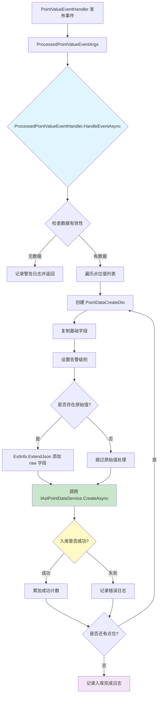

# ProcessedPointValueEventHandler — 时序数据入库处理器

## 概述

**ProcessedPointValueEventHandler** 负责将处理后的传感器点位数据持久化到时序数据库。作为数据入库链路的最终执行者，它接收来自 `PointValueEventHandler` 的处理后数据，将点位值存储到数据库中。

### 触发事件
- **事件类型**: `ProcessedPointValueEventArgs` (Local Event)
- **触发场景**: 点位数据处理完成，准备入库
- **事件源**: `PointValueEventHandler` 发布

### 核心职责
1. **时序数据入库** — 将点位值转换为 `PointData` 实体并存储
2. **扩展信息处理** — 处理原始值和扩展信息的JSON结构
3. **批量处理** — 批量存储多个点位值数据
4. **容错处理** — 单个点位失败不影响其他点位入库

### 处理特点
- **模块独立**: 属于 `ast-intellisubdata` 模块，专注时序数据存储
- **最终执行者**: 是事件驱动链路的最终环节
- **逐点处理**: 对每个点位值独立处理，互不影响
- **扩展信息增强**: 将原始值作为扩展信息存储

## 事件结构

### ProcessedPointValueEventArgs

```csharp
public class ProcessedPointValueEventArgs
{
    public MqPointValueDto Data { get; set; }
}

public class MqPointValueDto
{
    public List<MqPointValueItemDto> PointVals { get; set; }
}

public class MqPointValueItemDto
{
    public DateTime Ts { get; set; }                   // 采样时间戳
    public string DeviceId { get; set; }              // 设备ID
    public string SensorKey { get; set; }             // 传感器标识
    public string Property { get; set; }              // 属性名
    public string GroupId { get; set; }               // 分组ID
    public object Value { get; set; }                 // 处理后的值
    public object RawValue { get; set; }              // 原始值
    public DataValueTypeEnum? ValueType { get; set; }  // 值类型
    public string ExtInfo { get; set; }               // 扩展信息(JSON)
    public string PointId { get; set; }               // 点位ID
    public AlarmLevelEnum AlarmLevel { get; set; }    // 告警级别（已由上游更新）
}
```

### PointDataCreateDto

```csharp
public class PointDataCreateDto
{
    public string PointId { get; set; }               // 点位ID
    public string GroupId { get; set; }              // 分组ID
    public DateTime Ts { get; set; }                 // 采样时间
    public object Value { get; set; }               // 值
    public int? ValueType { get; set; }              // 值类型
    public string Property { get; set; }             // 属性名
    public string DeviceId { get; set; }             // 设备ID
    public string SensorKey { get; set; }            // 传感器标识
    public string ExtInfo { get; set; }             // 扩展信息（包含原始值）
    public AlarmLevelEnum AlarmLevel { get; set; }   // 告警级别
}
```

## 处理流程



### 关键处理步骤

#### 1. 数据验证
```csharp
if (eventData.Data?.PointVals == null || !eventData.Data.PointVals.Any())
{
    _logger.LogWarning("No point values to process");
    return;
}
```

#### 2. 点位值转换
```csharp
var pointData = new PointDataCreateDto
{
    PointId = pointVal.PointId,
    GroupId = pointVal.GroupId,
    Ts = pointVal.Ts,
    Value = pointVal.Value,
    ValueType = (int?)pointVal.ValueType,
    Property = pointVal.Property,
    DeviceId = pointVal.DeviceId,
    SensorKey = pointVal.SensorKey,
    ExtInfo = pointVal.ExtInfo,
    AlarmLevel = pointVal.AlarmLevel  // 告警级别已由上游更新
};
```

#### 3. 原始值处理
```csharp
if (pointVal.RawValue != null)
{
    // 将原始值作为扩展信息存储
    pointData.ExtInfo = pointVal.ExtInfo.ExtendJson(new { raw = pointVal.RawValue });
}
```

**作用**: 保留原始值用于数据追溯和分析

#### 4. 数据入库
```csharp
await _pointDataService.CreateAsync(pointData);
count++;
```

## 依赖服务

| 服务接口 | 用途 | 核心方法 |
|---------|------|---------|
| `IAstPointDataService` | 时序数据CRUD操作 | `CreateAsync` |

## 数据库实体

### PointDataEntity

时序数据表，存储所有传感器点位的历史数据：

| 字段名 | 类型 | 说明 | 索引 |
|-------|------|------|------|
| `Id` | Guid | 主键 | PK |
| `PointId` | string | 点位ID | Index |
| `GroupId` | string | 分组ID | Index |
| `Ts` | DateTime | 采样时间 | Index (Time-series) |
| `Value` | decimal | 值 | - |
| `ValueType` | int | 值类型 | - |
| `Property` | string | 属性名 | - |
| `DeviceId` | string | 设备ID | Index |
| `SensorKey` | string | 传感器标识 | - |
| `ExtInfo` | string | 扩展信息(JSON) | - |
| `AlarmLevel` | int | 告警级别 | Index |

## 配置项

### 数据库配置
```json
{
  "DbConnOptions": {
    "DbType": "Sqlite",          // 数据库类型
    "Url": "Data Source=db/ast_intellisub.db"
  }
}
```

### 数据保留策略
- 配置位置: `PointDataCleanupJob`
- 作用: 定期清理历史数据，控制数据库大小

## 错误处理

### 单个点位处理失败
```csharp
catch (Exception ex)
{
    _logger.LogError(ex, $"Error processing point value for point {pointVal.PointId} {pointVal.Property}");
    // 继续处理下一个点位，不中断整个批次
}
```

### 扩展信息处理失败
```csharp
catch (Exception err)
{
    _logger.LogError(err, $"Error processing point ExtInfo for point {pointVal.PointId} {pointVal.Property}: {pointVal.ExtInfo}");
    // 继续入库，只是不包含原始值
}
```

## 日志示例

```
[数据入库完成] 13 个属性点位已成功存储到数据库中
```

### 错误日志示例
```
Error processing point value for point point_001 temperature: ...
[数据入库完成] 12 个属性点位已成功存储到数据库中
```

## 订阅关系

### 上游发布者
- `PointValueEventHandler` — 点位编排处理器

### 同级订阅者（同一事件）
- `Iec61850DataReportHandler` — IEC61850数据上报处理器
- `PatrolResultUpdateHandler` — 巡检结果更新处理器

## 性能特点

1. **批量处理**: 一次性处理多个点位值
2. **容错机制**: 单个点位失败不影响其他点位
3. **逐点入库**: 每个点位独立调用数据库操作
4. **异步处理**: 使用 `async/await` 避免阻塞

## 相关文档

- [PointValueEventHandler.md](./PointValueEventHandler.md) — 上游编排处理器
- [EventDrivenPipeline.md](../EventDrivenPipeline.md) — 事件驱动链路总览
- [TimeSeriesData.md](../../../Architecture/TimeSeriesData.md) — 时序数据架构

## 源码位置

```
module/ast-intellisubdata/Ast.IntelliSubData.Application/EventHandlers/ProcessedPointValueEventHandler.cs
```
