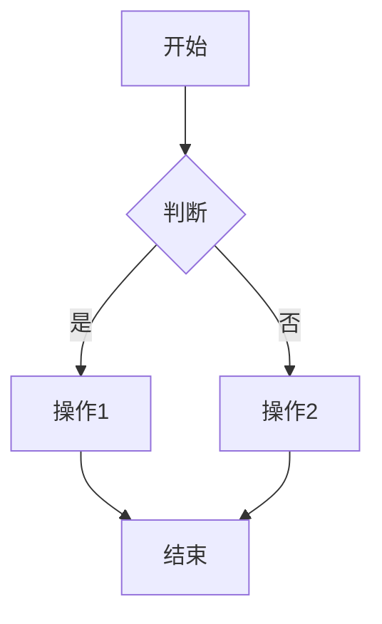
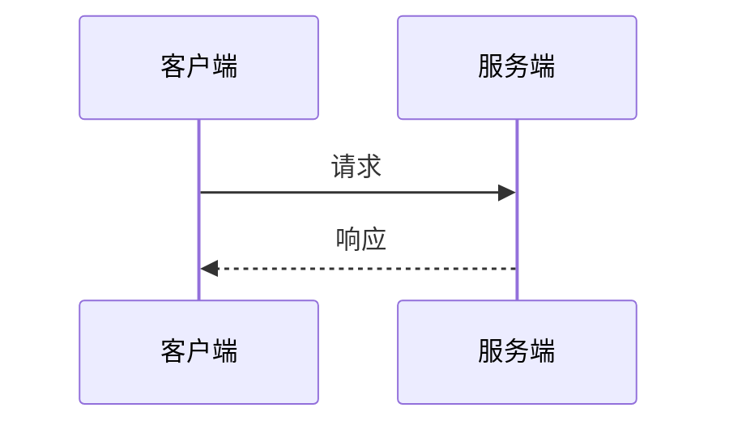

# Obsidian 知识库使用指南

本知识库基于 Obsidian 的双向链接功能构建，用于学习 IntelliSubstation Voiceprint Backend 项目。

---

## 快速开始

### 1. 打开知识库

1. 安装 Obsidian：https://obsidian.md/
2. 打开 Obsidian
3. 选择"打开文件夹"
4. 选择 `docs/obsidian` 目录

### 2. 推荐插件

在 **设置 → 社区插件 → 浏览** 中搜索并安装：

- **Dataview** — 数据查询和表格展示
- **Mermaid Tools** — Mermaid 图表增强
- **Advanced Slides** — 演示文稿

### 3. 启用代码片段

在 **设置 → 外观 → 代码片段** 中启用：

- `status-indicators.css` — 状态指示器样式

---

## 使用模板

### 快捷键设置

1. 进入 **设置 → 快捷键**
2. 为"插入模板"设置快捷键（如 `Ctrl+T`）
3. 使用时按快捷键，从 `Templates/` 目录选择模板

### 可用模板

| 模板 | 用途 | 路径 |
|------|------|------|
| 组件笔记模板 | 记录类/服务/组件 | `Templates/组件笔记模板.md` |
| 流程文档模板 | 记录业务流程 | `Templates/流程文档模板.md` |
| 概念文档模板 | 记录设计概念 | `Templates/概念文档模板.md` |
| API文档模板 | 记录API端点 | `Templates/API文档模板.md` |
| Hangfire任务模板 | 记录后台任务 | `Templates/Hangfire任务模板.md` |

---

## 双向链接

### 创建链接

```markdown
# 文档标题

这是对 [[其他文档]] 的引用。

这是指向其他文档的 [[其他文档|自定义显示文本]]。
```

### 查看反向链接

在文档右侧面板的"反向链接"中查看引用了当前文档的所有文档。

---

## 标签系统

### 模块标签

- `#rbac` — 认证授权模块
- `#intellisub` — 变电站监控模块
- `#voiceprint` — 声纹分析模块
- `#isapi` — 工业协议模块
- `#framework` — 框架层

### 类型标签

- `#appservice` — 应用服务
- `#entity` — 实体
- `#dto` — 数据传输对象
- `#api` — API端点
- `#flow` — 流程
- `#hangfire` — 后台任务
- `#concept` — 概念

### 层级标签

- `#Application` — 应用层
- `#Domain` — 领域层
- `#Infrastructure` — 基础设施层
- `#Web` — 表示层

---

## 属性 (Properties)

每个文档顶部使用 YAML frontmatter 定义属性：

```yaml
---
type: component
layer: #Application
module: #intellisub
status: learning
tags: [dotnet, abp]
source: src/...
---
```

### 属性说明

| 属性 | 说明 | 可选值 |
|------|------|--------|
| type | 文档类型 | component / flow / concept / api / background-job |
| layer | 所属层级 | #Application / #Domain / #Infrastructure / #Web |
| module | 所属模块 | #rbac / #intellisub / #voiceprint / #isapi / #framework |
| status | 学习状态 | learning / done / review |
| tags | 标签列表 | [标签数组] |
| source | 源码路径 | 相对或绝对路径 |

---

## 图表

### Mermaid 支持

本知识库支持 Mermaid 图表语法。

#### 流程图



#### 时序图



---

## Dataview 查询

### 基本查询

```dataview
LIST
FROM #intellisub
SORT file.name ASC
```

### 表格查询

```dataview
TABLE without id
  file.link as "名称",
  status as "状态",
  date as "日期"
FROM #appservice
WHERE status = "done"
SORT file.name ASC
```

### 任务查询

```dataview
TASK
FROM "Modules"
WHERE !completed
SORT due ASC
```

---

## 笔记工作流

### 1. 学习新组件

1. 从模板创建新笔记（`组件笔记模板.md`）
2. 填写基本信息（位置、职责、接口）
3. 添加相关组件的双向链接
4. 记录学习笔记和疑问

### 2. 记录流程

1. 从模板创建流程笔记（`流程文档模板.md`）
2. 绘制流程图（Mermaid）
3. 记录详细步骤
4. 关联相关 API 和组件

### 3. 记录 API

1. 从模板创建 API 笔记（`API文档模板.md`）
2. 记录请求/响应格式
3. 添加代码示例
4. 关联实现的服务

---

## 常用技巧

### 1. 使用图谱视图

点击左侧边栏的"关系图谱"图标，可视化查看文档之间的链接关系。

### 2. 使用面包屑导航

通过属性面板或反向链接快速导航到相关文档。

### 3. 使用快速切换

按 `Ctrl+O` (Mac: `Cmd+O`) 快速打开和切换文档。

### 4. 使用大纲视图

在右侧面板的"大纲"中查看当前文档的标题结构。

---

## 搜索技巧

### 全文搜索

- `Ctrl+Shift+F` (Mac: `Cmd+Shift+F`) 打开全局搜索
- 支持正则表达式
- 支持排除路径

### Dataview 搜索

```dataview
LIST
FROM "Modules/rbac"
WHERE contains(content, "关键词")
```

---

## 导出和分享

### 导出为 Markdown

1. 文件 → 导出
2. 选择格式

### 导出为 PDF

1. 安装 PDF 导出插件
2. 文件 → 导出 → PDF

### 发布到网络

使用 Obsidian Publish 或其他静态站点生成器。

---

## 常见问题

### Q: 如何批量修改属性？

A: 使用 Dataview 配合脚本，或手动编辑。

### Q: 如何处理断链？

A: 在"反向链接"面板中检查断链，然后更新链接。

### Q: 如何备份知识库？

A: 使用 Git 版本控制，或定期复制整个文件夹。

---

## 进阶技巧

### 1. 使用 Canvas

创建可视化思维导图和概念图。

### 2. 使用工作区

保存不同的工作区布局，方便切换工作场景。

### 3. 使用书签

为常用文档添加书签，快速访问。

---

> 创建时间：2026-06-02
> 基于项目：IntelliSubstation Voiceprint Backend
