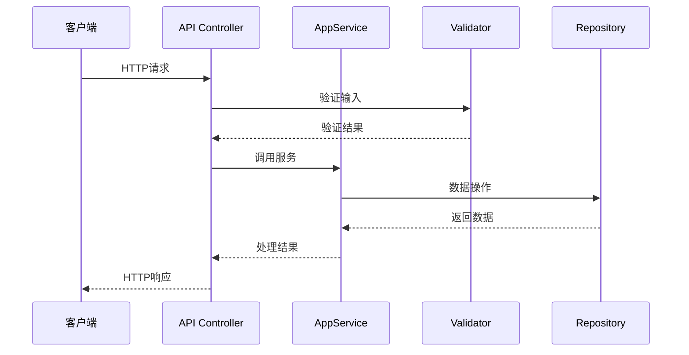

# {{API名称}}

## API 概述

**功能**：API的功能描述

**路由**：`/api/app/{module}/{controller}/{action}`

**方法**：GET / POST / PUT / DELETE

**权限**：所需权限

---

## 请求定义

### 请求头

```http
Content-Type: application/json
Authorization: Bearer {token}
```

### 路径参数

| 参数 | 类型 | 必填 | 说明 |
|------|------|------|------|
| id | Guid | 是 | 资源ID |

### 查询参数

| 参数 | 类型 | 必填 | 说明 |
|------|------|------|------|
| keyword | string | 否 | 搜索关键词 |
| skip | int | 否 | 跳过数量 |
| maxResultCount | int | 否 | 最大结果数 |

### 请求体

```json
{
  "property": "value"
}
```

**字段说明**：

| 字段 | 类型 | 必填 | 说明 |
|------|------|------|------|
| property | string | 是 | 字段说明 |

---

## 响应定义

### 成功响应

```json
{
  "result": {
    "id": "guid",
    "property": "value"
  }
}
```

### 错误响应

```json
{
  "error": {
    "code": "Error code",
    "message": "Error message",
    "details": "Detailed error information"
  }
}
```

---

## 服务端实现

### 应用服务

**类**：[[AppService]]

**方法**：

```csharp
[Authorize(ModulePermissions.ModuleName.Action)]
public async Task<ResultDto> MethodAsync(InputDto input)
{
    // 实现逻辑
}
```

### 请求验证

```csharp
public class InputDto
{
    [Required]
    [StringLength(...)]
    public string Property { get; set; }
}
```

---

## 业务流程



---

## 权限控制

### 权限定义

```csharp
public static class ModulePermissions
{
    public const string ModuleName = "ModuleName.ModuleName";
    public const string Create = ModuleName + ".Create";
    public const string Update = ModuleName + ".Update";
    public const string Delete = ModuleName + ".Delete";
}
```

### 权限检查

```csharp
[Authorize(ModulePermissions.ModuleName.Action)]
public async Task<ActionResult> Method()
{
    // 需要权限才能访问
}
```

---

## 使用示例

### cURL

```bash
curl -X POST 'https://api.example.com/api/app/module/action' \
  -H 'Authorization: Bearer YOUR_TOKEN' \
  -H 'Content-Type: application/json' \
  -d '{"property": "value"}'
```

### JavaScript (fetch)

```javascript
const response = await fetch('/api/app/module/action', {
  method: 'POST',
  headers: {
    'Authorization': `Bearer ${token}`,
    'Content-Type': 'application/json'
  },
  body: JSON.stringify({ property: 'value' })
});

const data = await response.json();
```

---

## 相关 API

- [[相关API1]] - 说明
- [[相关API2]] - 说明

## 相关组件

- [[AppService]] - 服务实现
- [[DTO]] - 数据传输对象
- [[Entity]] - 实体定义

---

## 错误码

| 错误码 | HTTP状态 | 说明 |
|--------|---------|------|
| VALIDATION_ERROR | 400 | 输入验证失败 |
| AUTHORIZATION_ERROR | 403 | 权限不足 |
| NOT_FOUND | 404 | 资源不存在 |

## 注意事项

<!-- 开发和使用的注意事项 -->

---
**状态**：🟡 学习中
