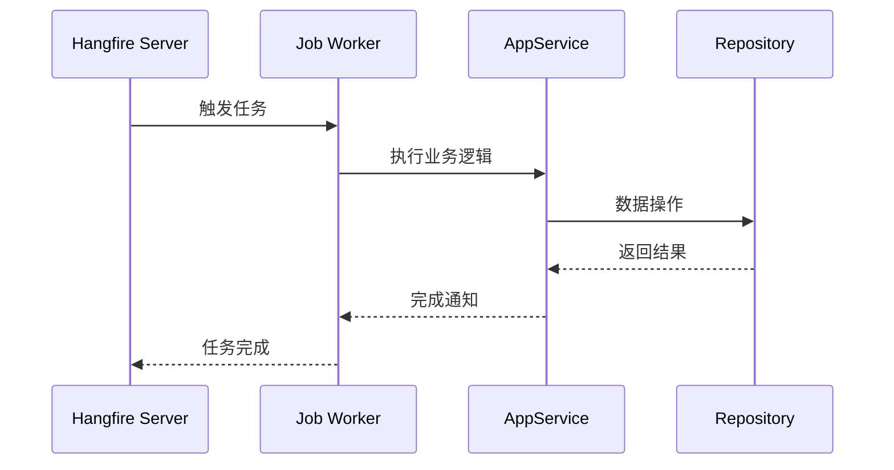

# {{任务名称}}

## 任务概述

**功能**：定时任务的功能描述

**触发方式**：Cron表达式 / 手动触发

**Cron表达式**：`0 */10 * * * *`

**存储模式**：Memory / SQLite / Redis

---

## 任务配置

### appsettings.json 配置

```json
{
  "Hangfire": {
    "StorageMode": "Memory",
    "DashboardEnabled": true
  },
  "Jobs": {
    "{{JobName}}": {
      "Enabled": true,
      "CronExpression": "0 */10 * * * *"
    }
  }
}
```

### 注册代码

```csharp
public class JobModule : AbpModule
{
    public override void OnApplicationInitialization(ApplicationInitializationContext context)
    {
        var jobManager = context.ServiceProvider.GetRequiredService<IBackgroundJobManager>();

        // 配置定时任务
        var job = new RecurringJob
        {
            Id = "{{JobName}}",
            CronExpression = "0 */10 * * * *",
            Job = new Job(() => ExecuteAsync())
        };

        jobManager.AddOrUpdate(job);
    }
}
```

---

## 任务执行流程



---

## 任务实现

### 任务类

```csharp
public class {{JobName}} : AsyncBackgroundJob<{{JobArgs}}>
{
    private readonly I{{ServiceName}} _service;

    public {{JobName}}(I{{ServiceName}} service)
    {
        _service = service;
    }

    public override async Task ExecuteAsync({{JobArgs}} args)
    {
        // 任务逻辑
        Logger.LogInformation("Starting {{JobName}}...");

        await _service.ProcessAsync();

        Logger.LogInformation("{{JobName}} completed.");
    }
}
```

### 参数定义

```csharp
public class {{JobArgs}}
{
    public string Property { get; set; }
}
```

---

## 关键逻辑

### 数据获取

<!-- 如何获取需要处理的数据 -->

### 数据处理

<!-- 如何处理数据 -->

### 结果存储

<!-- 如何存储结果 -->

---

## 错误处理

```csharp
try
{
    // 任务逻辑
}
catch (Exception ex)
{
    Logger.LogError(ex, "Job failed: {Message}", ex.Message);

    // 重试策略
    throw new JobExecutionException("Job execution failed", ex)
    {
        RetryAttempts = 3,
        RetryDelay = TimeSpan.FromMinutes(5)
    };
}
```

---

## 监控和日志

### 日志记录

```csharp
Logger.LogInformation("Job started at {Time}", DateTime.Now);
Logger.LogInformation("Processed {Count} items", count);
Logger.LogInformation("Job completed in {Duration}", duration);
```

### Hangfire Dashboard

访问路径：`/hangfire`

查看任务执行历史和状态。

---

## 性能考虑

- 执行时长
- 资源占用
- 并发控制

### 优化建议

1. 使用分页处理大量数据
2. 合理设置重试策略
3. 添加超时控制

---

## 相关任务

- [[相关任务1]] - 说明
- [[相关任务2]] - 说明

## 相关服务

- [[AppService]] - 使用的应用服务
- [[Repository]] - 数据访问

---

## Cron 表达式说明

| 表达式 | 说明 |
|--------|------|
| `0 */10 * * * *` | 每10分钟执行 |
| `0 0 * * * *` | 每小时执行 |
| `0 0 0 * * *` | 每天执行 |
| `0 0 0 ? * MON-FRI` | 工作日执行 |

---
**状态**：🟡 学习中
