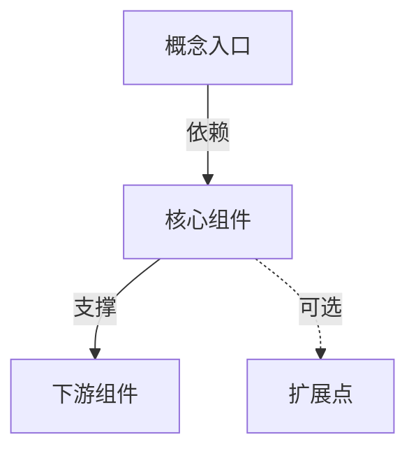

# {{概念名称}}

## 问题背景

<!-- 描述这个设计要解决什么问题 -->

### 业务场景
<!-- 具体的业务场景描述 -->

### 技术挑战
<!-- 面临的技术挑战 -->

---

## 设计方案

### 为什么这样设计

#### 方案 A：{{被抛弃的方案}}

**原理**：简述

**优点**：
- 优点1

**缺点**：
- 缺点1
- 缺点2

**结论**：为什么不用

#### 方案 B：{{采用的方案}}

**原理**：简述

**优点**：
- 优点1
- 优点2

**代价**：
- 代价1
- 代价2

**结论**：为什么采用

---

## 技术细节

### 核心机制

```csharp
// 关键代码示例
public class Example
{
    // 核心逻辑
}
```

### 数据结构

```csharp
public class KeyEntity
{
    // 字段说明
}
```

### 配置示例

```json
{
  "key": "value"
}
```

---

## 架构图



---

## DDD 分层视角

| 层 | 职责 | 示例 |
|----|------|------|
| Application | 应用服务编排 | AppService |
| Domain | 领域逻辑 | Entity, ValueObject |
| Infrastructure | 技术实现 | Repository, DbContext |

---

## 相关概念

- [[相关概念1]] - 说明
- [[相关概念2]] - 说明
- [[相关组件]] - 实现组件

## ABP 集成

### 模块集成

```csharp
[DependsOn(
    typeof(AbpEntityFrameworkCoreModule),
    typeof(AbpAutoMapperModule)
)]
public class MyModule : AbpModule
{
    // 模块配置
}
```

### 最佳实践

- 实践1
- 实践2

---

## 参考资料

- [ABP Framework 文档](https://docs.abp.io/)
- 相关源码：`路径`
- 设计参考：文档/博客链接

---
**状态**：🟡 学习中
