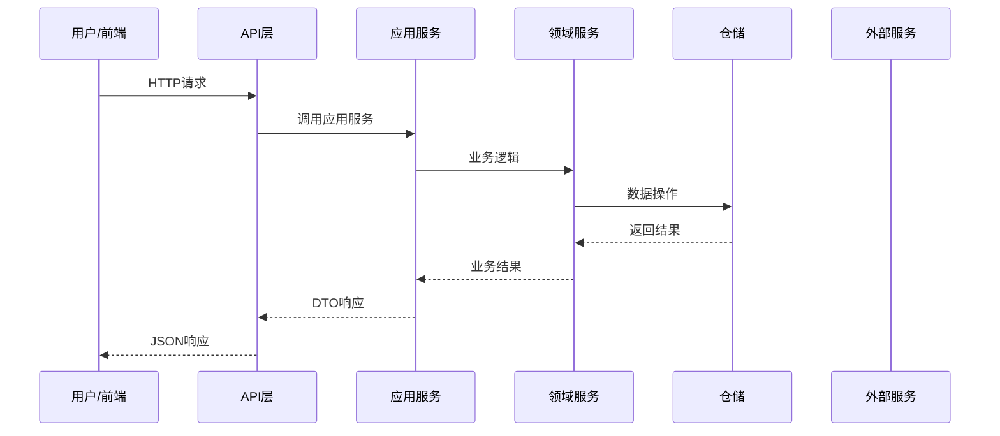

# {{流程名称}}

## 流程概述

<!-- 描述这个流程的业务目的和触发条件 -->

**触发方式**：用户操作 / 定时任务 / 系统事件 / 外部调用

---

## 完整流程图



---

## 详细步骤

### 步骤 1：{{步骤名称}}

**负责组件**：[[组件名]]

**操作**：
1. 子操作1
2. 子操作2

**输入**：输入数据

**输出**：输出数据

---

### 步骤 2：{{步骤名称}}

**负责组件**：[[组件名]]

**操作**：
1. 子操作1
2. 子操作2

---

## 数据流向

```
前端请求
  ↓
[Controller] - 路由与验证
  ↓
[AppService] - 业务编排
  ↓
[DomainService] - 领域逻辑
  ↓
[Repository] - 数据持久化
  ↓
数据库/外部服务
```

## 涉及的API端点

| 方法 | 路径 | 服务 | 功能 |
|------|------|------|------|
| POST | `/api/app/{module}/{controller}` | AppService | 说明 |

## 涉及的实体

| 实体 | 表名 | 说明 |
|------|------|------|
| EntityName | table_name | 说明 |

## 错误处理

### 常见错误

| 错误 | 原因 | 处理 |
|------|------|------|
| BadRequestException | 参数验证失败 | 返回400 |
| BusinessException | 业务规则违反 | 返回错误消息 |

## 性能考虑

- 数据库查询优化
- 缓存策略
- 异步处理

## 相关流程

- [[前置流程]] - 前置条件
- [[后续流程]] - 后续操作
- [[相关流程]] - 其他相关流程

---

## 实现细节

### 关键代码

```csharp
// 关键实现代码
```

## 学习笔记

### 理解要点
<!-- 流程的核心理解 -->

### 疑问
<!-- 待解决的问题 -->

---
**状态**：🟡 学习中
